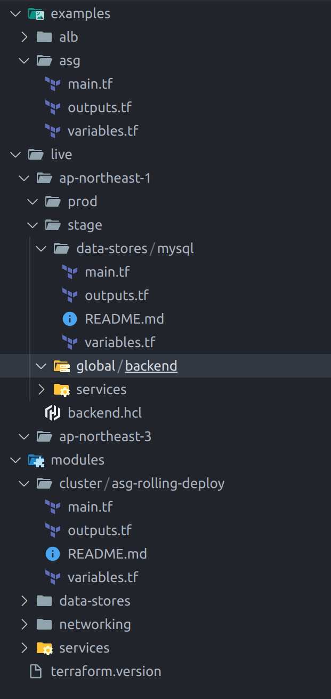

# ファイル構成



- examples ディレクトリ: モジュールの使用例を格納する
- live ディレクトリ: リージョン・環境（stage 環境など）ごとにディレクトリを分けその中に作成したいインフラごとのディレクトリを作成する
  - 各環境ディレクトリにステートバックエンドについて記載した backend.hcl ファイルを格納する
- modules ディレクトリ: 各種モジュールを格納する
- terraform.version ファイル: プロジェクトのルートディレクトリに Terraform コアのバージョンを記述する（tfenv が自動的に記述したバージョンの terraform を使用する）

modules ディレクトリも Git リポジトリにして、モジュール呼び出し時にモジュールの Git リポジトリのモジュールを参照にするほうが良い（バージョン管理ができるため）。

live のルートモジュール

```main.tf
module "asg" {
  # githubのURLを指定し、gitタグでどのコミット使用するかも指定する
  source = "github.com/kuritaeiji/terraform-module//modules/cluster/asg-rolling-deploy?ref=v0.0.1"
}
```
