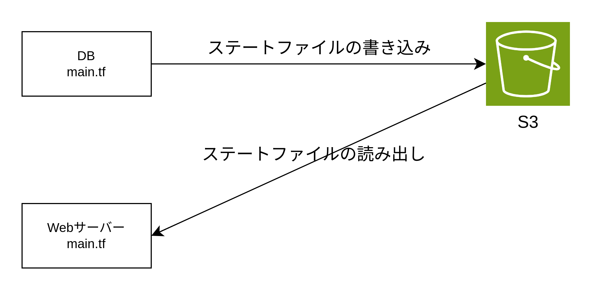

# ステート管理

## terraform.tfstate ファイル

- terraform.tfstate ファイルは実際に AWS にプロビジョニングしたリソースの情報が Terraform によって書き込まれるファイル
- DB のユーザー名・パスワードなどの機密情報も書き込まれるので S3 にアップロードするようにバックエンドを設定する

## バックエンドの種類

- ローカルバックエンド: terraform.tfstate ファイルがディレクトリに作成される
- リモートバックエンド: S3・Google Cloud Storage などのストレージに terraform.tfstate をアップロードできる。ロック・暗号化もできる。

## バックエンド設定

- ステートファイルの共有ストレージ
  - terraform.tfstate ファイルを S3 にアップロードする（バージョン管理・暗号化を実施する）
  - 各チームメンバーがアクセスできるよう共有された場所に置く
- ステートファイルのロック
  - DynamoDB を使用してロックの仕組みを提供する
  - ロックの仕組みがないと 2 人のチームメンバーが Terraform を同時に実行した際に同時にステートファイルを更新しようとするため競合が発生する。よってロックが必要。
- ステートファイルの分離
  - ステートファイルの共有ストレージはリージョン・環境ごとに別の S3 バケットを使用する
  - EC2 サーバー・DB・ALB ごとに別々のステートファイルを同じ S3 バケットにアップロードする必要があるため、異なるオブジェクト名（キー名）を使用する

## S3・DynamoDB の設定

```variables.tf
variable "bucket_name" {
  type = string
  description = "S3バケット名"
}

variable "dynamodb_table_name" {
  type = string
  description = "DynamoDBのテーブル名"
}
```

```main.tf
terraform {
  required_version = "~> 1.0"

  required_providers {
    aws = {
      source = "hashicorp/aws"
      version = "~> 5.0"
    }
  }
}

resource "aws_s3_bucket" "state" {
  bucket = var.bucket_name

  lifecycle {
    prevent_destroy = true
  }
}

resource "aws_s3_bucket_versioning" "state" {
  bucket = aws_s3_bucket.state.id
  versioning_configuration {
    status = "Enabled"
  }
}

resource "aws_s3_bucket_server_side_encryption_configuration" "default" {
  bucket = aws_s3_bucket.state.id

  rule {
    # aws/s3のS3が管理するCMKを使用してサーバーサイド暗号化する
    apply_server_side_encryption_by_default {
      sse_algorithm = "AES256"
    }
  }
}

resource "aws_s3_bucket_public_access_block" "public_access" {
  bucket = aws_s3_bucket.tate.id

  # バケットに新しいパブリックACL（アクセス制御リスト）を付与することを防ぐ
  block_public_acls = true
  # バケットに新しいパブリックアクセスポリシーを付与することを防ぐ
  block_public_policy = true
  # バケットおよびバケット内のオブジェクトに設定されているパブリックACLによって付与されたアクセス権限を無視する
  ignore_public_acls = true
  # パブリックアクセスポリシーまたはACLによってパブリックアクセスが許可されているバケットに対して、そのパブリックアクセスを制限する
  restrict_public_buckets = true
}

resource "aws_dynamodb_table" "state_lock" {
  name = var.dynamodb_table_name
  billing_mode = "PAY_PER_REQUEST"
  hash_key = "LockID"

  attribute {
    name = "LockID"
    type = "S"
  }
}
```

## ルートモジュールでのバックエンドの定義方法

ルートモジュール内にバックエンドの定義をする。バックエンドの定義内では変数を使用できない。バックエンド設定では、リージョン名・バケット名・オブジェクト名（キー名）・DynamoDB テーブル名・暗号設定を記述する必要がある。オブジェクト名（キー名）以外は backend.hcl に記述して共通化できる。

```main.tf
terraform {
  backend "s3" {
    key = "stage/networking/alb/terraform.tfstate"
  }
}
```

```backend.hcl
bucket="<バケット名>""
region="<リージョン名>""
dynamodb_table="<DynamoDBテーブル名>""
encrypt=true
```

```bash
terraform init -backend-config=backend.hcl
```

## backend の切り替え方

### S3 → local に変更する場合

1.backend をローカルに切り替える

```main.tf
terraform {
#  backend "s3" {
#    bucket = "mybucket"
#    key    = "path/to/my/key"
#    region = "ap-northeast-1"
#  }
   backend "local" {
     path   = "terraform.tfstate"
   }
}
```

2.terraform init -migrate-state を実行する。（S3 に保存されているステートファイルをローカル PC にコピーする）

```bash
terraform init -migrate-state
```

### local → S3 に切り替える

1.backend を local から S3 に戻す

```main.tf
terraform {
  backend "s3" {
    key = "stage/services/alb/terraform.tfstate"
  }
}
```

2.terraform init -backend-config=backend.hcl を実行する（ローカルの terraform.tfstate を S3 にコピーする）-reconfigure がいるかも？

```bash
terraform init -backend-config=backend.hcl
```

## terraform_remote_state データソース

terraform_remote_state データソースを使用すると、別の Terraform 設定で保存されている Terraform ステートファイルを読み出すことができる。`data.terraform_remote_state.<名前>.outputs.<属性名>`で参照できる。



```main.tf
data "terraform_remote_state" "db" {
  backend = "s3"

  config = {
    bucket = <バケット名>
    key = "stage/data-stores/mysql/terraform.tfstate"
    region = "us-east-2"
  }
}

output "db_username" {
  value = data.terraform_remote_state.db.outputs.username
  description = "DBのユーザー名"
}

output "db_password" {
  value = data.terraform_remote_state.db.outputs.password
  description = "DBのパスワード"
}
```
