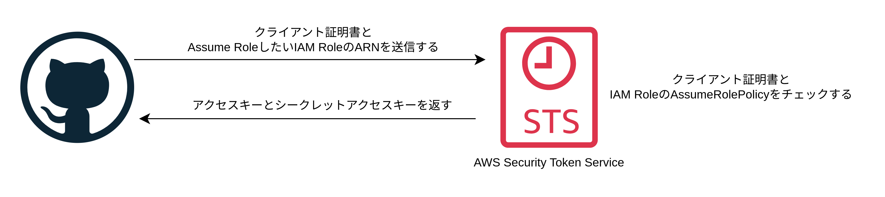

# シークレット管理

シークレット管理の基本は**プレーンテキストにシークレットを保存しアップロードしない**。

## シークレット管理管理ツール

シークレット管理の全ての特徴を総合的に見いていく。

- シークレットの種類
  - 個人シークレット: 個人に紐づくもの。SSH キー・AWS アクセスキー・自分自身の Web アプリのユーザー名とパスワードなど。
  - 顧客シークレット: 顧客に紐づくもの。作成している Web アプリの顧客がログインするときのユーザー名とパスワードなど。
  - インフラシークレット: インフラに紐づくもの。DB のパスワード・API キー・TLS 証明書など。
- シークレットの保存方法
  - ファイルベースのシークレットストア: AWS KMS などのクラウドプロバイダーが提供するキーマネジメントサービスが管理するキーや GPG などローカルで管理するキーを利用してファイルを暗号化する
  - 集中型のシークレットストア: ネットワーク越しにアクセスできる Web サービスであることが多く、シークレットを暗号化しそれらを MySQL、DynamoDB といったデータストアに保存する
- シークレットにアクセスできるインターフェース
  - CLI: ファイルベースのシークレットストアは CLI 経由で動く。集中型のシークレットストアも CLI をサポートするが内部では API を呼び出している。
  - UI: 集中型のシークレットストアはユーザーインターフェース(UI)を持つものが多い。

|                                   | 種類     | 保存方法       | インターフェース |
| :-------------------------------- | :------- | :------------- | :--------------- |
| AWS Secrets Manager               | インフラ | 集中型サービス | UI・API・CLI     |
| キーチェーン（macOS）             | 個人     | ファイル       | UI・CLI          |
| 資格情報マネージャー（Windows）   | 個人     | ファイル       | UI・CLI          |
| GNOME Keyring・Seahorse（Ubuntu） | 個人     | ファイル       | UI・CLI          |
| Auth0                             | 顧客     | 集中型サービス | UI・API・CLI     |
| AWS Cognito                       | 顧客     | 集中型サービス | UI・API・CLI     |

## Terraform のシークレット管理

Terraform でシークレット管理すべきものは 3 種類ある。

- プロバイダー
- リソースとデータソース
- ステートファイル

### プロバイダー（ローカル PC）

AWS の場合は、AWS に認証するためにアクセスキーとシークレットアクセスキーを使う必要がある。

1\. 環境変数としてアクセスキーとシークレットアクセスキーを設定する

```bash
export AWS_ACCESS_KEY_ID=<アクセスキー>
export AWS_SECRET_ACCESS_KEY=<シークレットアクセスキー>
```

2\. ~/.aws/credentials に保存されているアクセスキーとシークレットアクセスキーを使用する

```main.tf
provider "aws" {
  region = "us-east-2"
  # defaultプロファイルのアクセスキーとシークレットアクセスキーを使用する
  profile = "default"
}
```

3\. aws-vault を使用する

```bash
# aws-vaultがgnome-keyringを使用するようにする
# macではデフォルトでキーチェーンが使用される
export AWS_VAULT_BACKEND=secret-service
# コマンドラインの指示に従ってアクセスキーとシークレットアクセスキーを入力する
aws-vault add dev
aws-vault exec dev -- terraform apply
```

### プロバイダー（マシンユーザー）

1\. Jenkins を CI サーバーとして動かす場合（IAM ロールを使用する）

```main.tf
resource "aws_instance" "jenkins" {
  ami = "ami-0fb653ca2d3203ac1"
  instance_type = "t2.micro"

  aws_instance_profile = aws_iam_instance_profile.instance.name
}

data "aws_iam_policy_document" "assume_role" {
  statement {
    effect = "Allow"
    actions = ["sts:AssumeRole"]
    principal = {
      type = "Service"
      identifiers = ["ec2.amazonaws.com"]
    }
  }
}

resource "aws_iam_role" "instance" {
  name = var.name
  assume_role_policy = data.aws_iam_policy_document.assume_role.json
}

data "aws_iam_policy_document" "ec2_admin_permission" {
  statement = {
    effect = "Allow"
    actions = ["ec2:*"]
    resources = ["*"]
  }
}

resource "aws_iam_role_policy" "instance" {
  role = aws_iam_role.instance.id
  policy = data.aws_iam_policy_document.ec2_admin_permission.json
}

resource "aws_iam_instance_profile" "instance" {
  role = aws_iam_role.instance.name
}
```

2\. GitHubActions を使用する場合（OIDC を使用する）

環境変数にアクセスキーとシークレットアクセスキーを設定する方法もあるが非推奨。
OIDC を使用して AWS から Assume Role して一時的な認証情報（制限時間付きのアクセスキーとシークレットアクセスキー）を入手する方法を使用する。



GitHubActions の YAML ファイル

```yaml
on:
  push:
    branches:
      - 'main'

jobs:
  TerraformApply:
    runs-on: ubuntu-latest
    steps:
      - uses: actions/checkout@v2
      - uses: hashicorp/configure-aws-credentials@v1
          # exam-roleをAssumeRoleする
          role-to-assume: arn:aws:iam::11111:role/example-role
          aws-regin: us-east-2
      - uses: hashicorp/setup-terraform@v1
          with:
            terraform_version: 1.8.4
            terraform_wrapper: false
          run: |
            terraform init
            terraform apply -auto-approve
```

Terraform ファイル

```main.tf
// GitHubActionsのクライアント証明書
data "tls_certificate" "github" {
  url = "https://token.actions.githubusercontent.com"
}

// GitHubActionsをEC2やAWSアカウントのようにRoleを引き受ける対象としてAWSに登録する
resource "aws_iam_openid_connect_provider" "github_actions" {
  url = "https://token.actions.githubusercontent.com"
  client_id_list = ["sts.amazonaws.com"]
  # クライアント証明書のフィンガープリント
  thumbprint_list = [data.tls_certificate.github.certificates[0].sha1_fingerprint]
}

data "aws_iam_policy_document" "assume_role_policy" {
  statement {
    effect = "Allow"
    actions = ["sts:AssumeRoleWithWebIdentity"]
    principals {
      identifiers = [aws_iam_openid_connect_provider.github_actions.arn]
      type = "Federated"
    }

    condition {
      test = "StringEquals"
      variable = "token.actions.githubusercontent.com:sub"
      # 特定のリポジトリ・ブランチのみAssumeRoleを許可する
      values = [
        for github in var.allowed_repo_branches:
        "repo:${github["username"]}/${github["repo"]}:ref:refs/heads/${github["branch"]}"
      ]
    }
  }
}

resource "aws_iam_role" "example_role" {
  name_prefix = "example-role"
  assume_role_policy = data.aws_iam_policy_document.assume_role_policy.json
}
```

### リソースとデータソース

リソースやデータソースにシークレットを渡したい場合は以下の 3 つの方法でシークレットを渡す

- 環境変数
- 暗号化されたファイル
- シークレットストア

1\. 環境変数（無料）

変数を定義し TF*VAR*<変数名>の環境変数でシークレットを渡す。

```main.tf
variable "db_username" {
  type = string
  sensitive = true
}

variable "db_password" {
  type = string
  sensitive = true
}

resource "aws_db_instance" "example" {
  username = var.username
  password = var.password
}
```

```env.sh
export TF_VAR_db_username=username
export TF_VAR_db_password=password
```

2\. 暗号化されたファイル（安い）

シークレットをファイルに記述し、ファイルを暗号化して保存し、バージョン管理システムに保存する。暗号化の鍵には AWS KMS を使用する。シークレットを Terraform ファイルから参照する場合は、aws_kms_secrets データソースを使用して暗号化されたファイルを複合して参照する。

```main.tf
# defaultプロファイルのIAMユーザー
data "aws_caller_identity" "self" {}

data "aws_iam_policy_document" "cmk_admin_policy" {
  statement {
    effect = "Allow"
    actions = ["kms:*"]
    resources = ["*"]
    principals {
      type = "AWS"
      identifiers = [data.aws_caller_identity.self.arn]
    }
  }
}

resource "aws_kms_key" "cmk" {
  // cmkを使用可能なのはprofile=defaultのIAMユーザーのみ
  policy = data.aws_iam_policy_document.cmk_admin_policy.json
}

resource "aws_kms_alias" "cmk" {
  name = "alias/kms-cmk-example"
  target_key_id = aws_kms_key.cmk.id
}

data "aws_kms_secrets" "creds" {
  secret {
    name = "db"
    payload = file("${path.module}/db-creds.yaml.encrypted")
  }
}

locals {
  db_creds = yamldecode(data.aws_kms_secrets.creds.plaintext["db"])
}

output "db_creds" {
  value = "username: ${local.db_creds.db_username}, password: ${local.db_creds.db_password}"
  sensitive = true
}
```

```encrypt.sh
#!/bin/bash

CMK_ID=$1
AWS_REGION=$2
INPUT_FILE=$3
OUTPUT_FILE=$4

cipertext=$(aws kms encrypt \
    --key-id=$CMK_ID \
    --region=$AWS_REGION \
    --plaintext "fileb://$INPUT_FILE" \
    --output text \
    --query CiphertextBlob)

echo $cipertext > $OUTPUT_FILE
```

上記の encrypt.sh を使用してファイルを暗号化する

```bash
# cmkを使用してdb-creds.yamlを暗号化してdb-creds.yaml.encryptedに出力する
./encrypt.sh alias/kms-cmk-example/us-east-2 db-creds.yaml db-creds.yaml.encrypted
```

3\. シークレットストア（高額）

AWS SecretsManager にブラウザからシークレットを登録し`aws_secrets_manager_secret_version`データソースを使用してシークレットを参照する

```main.tf
data "aws_secretsmanager_secret_version" "creds" {
  secret_id = "db_creds"
}

locals {
  db_creds = jsondecode(data.aws_secretsmanager_secret_version.creds.secret_string)
}

output "secrets" {
  sensitive = true
  value = "${local.db_creds.db_username}, ${local.db_creds.db_password}"
}
```

### ステートファイル

Terraform リソースやデータソースに渡したどんなシークレットも、ステートファイルにプレーンテキストとして保存されてしまう。よって以下の対策を取る。

- バックエンドをローカルに設定している場合: .gitignore に terraform.tfstate を指定して GitHub にステートファイルをアップロードしないようにする
- バックエンドを S3 に設定している場合: 暗号化とアクセス可能な人間を制限する
