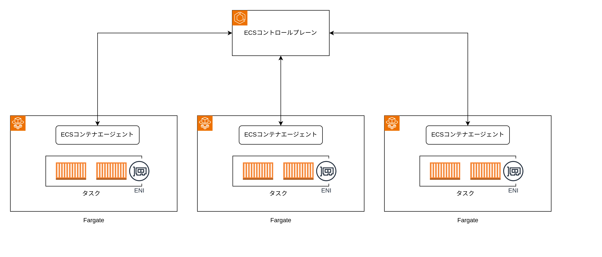
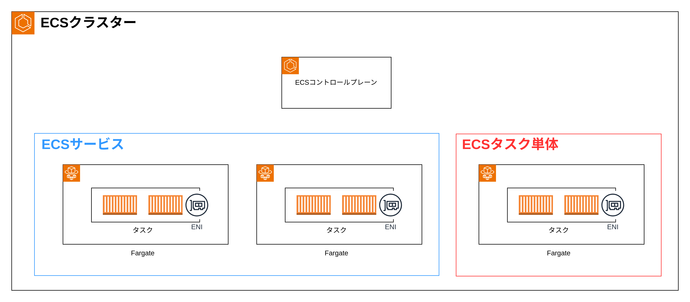

# ECS

## コンポーネント図

- ECS コンテナオーケストレーション（Kubernetes のコントロールプレーン）
  - タスク定義の保持
  - タスク数の管理・オートスケーリング
  - ローリングアップデート
- ECS コンテナ エージェント（Kubernetes の kubelet）
  - コンテナレジストリからコンテナイメージを取得する
  - タスクに記述されたコンテナの起動と停止
  - リソースの監視と報告（ECS コンテナオーケストレーションに報告する）
  - プロセスレベルのヘルスチェック
  - ログ送信（awslog ドライバーによる CloudWatchLog グループへのログ送信）

## リソース図

- クラスター（Kubernetes の Kubernetes クラスタ）
  - 複数のサービス
  - 複数の起動したタスク（タスク単体でも起動できる）
- サービス（Kubernetes の Deployment）
  - 複数の起動したタスク
- タスク（Kubernetes の Pod、タスク定義を基に実際に AWS 上で起動しているリソース）
  - ENI
  - 複数のコンテナ
- タスク定義（起動したいタスクについて定義したリソース）

クラスター内に複数のサービスを起動できる。またサービスを使用せずタスクを単体で起動もできる。

## サーバーの種類

- Fargate: サーバー上に 1 つのタスクのみ起動する
- EC2: サーバー上に複数のタスクが起動する

## ネットワークモード

- awsvpc: タスクに 1 つの ENI が付与される（Farget ではこのネットワークモードのみ使用可能）
- bridge: Docker のブリッヂネットワーク
- host: Docker のホストネットワーク
- none: Docker の None ネットワーク

## ロールの種類

- タスク実行ロール: ECS コンテナエージェントが使用するロール（CloudWatchLogs・ECR・SSM パラメータなどのポリシー）
- タスクロール: タスクが使用するロール（アプリケーションコードが s3 や lambda を使用する場合はポリシーを追加する）

## イメージプル

イメージをプルするためには Docker イメージリポジトリと通信する必要がある。よって以下のどちらかのように設定する。

- パブリックサブネットの場合: タスクの ENI にパブリック IP アドレスを付与する
- プライベートサブネットの場合: NAT ゲートウェイをパブリックサブネットに配置し、ルートテーブルのデフォルトゲートウェイを NAT ゲートウェイに向ける

## ログ出力

1. コンテナで起動しているアプリケーションが標準出力にログを出力すると awslogs ドライバーがホストファイルシステムの/var/log/ecs/ecs-agent.log に書き込む
2. ECS コンテナエージェントがログを CloudWatchLogs に送信する
