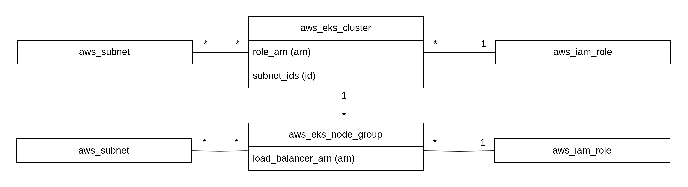

# EKS (Elastic Kubernetes Service)

- EKS はクラスタ・コントロールプレーンを管理してくれる
- EKS はワーカーノードの管理とオートスケーリングを実施してくれる

## EKS 使用方法

`aws_eks_cluster`と`aws_eks_node_group`を使用する

- aws_eks_cluster: クラスタとコントロールプレーンを作成する。サブネットに配置する。セキュリティーグループの作成・削除などの権限を持つロールが必要。
- aws_eks_node_group: ワーカーノードのオートスケーリンググループを作成する。サブネットを指定して配置する。ECR 読み取り、ENI に関する権限、ワーカーノードに対する権限などを持つロールが必要。

## kubectl を使用するために必要なこと

kubectl で EKS の kube-apiserver と通信するためには以下の情報が必要

- kube-apiserver のホスト名
- CA 証明書（中間認証局がドメイン名と公開鍵の署名に使用する証明書。CA 証明書もドメイン名と公開鍵を持つ。Certificate Authority 証明書）
- Kubernetes クラスタへの認証に使用する Bearer トークン
