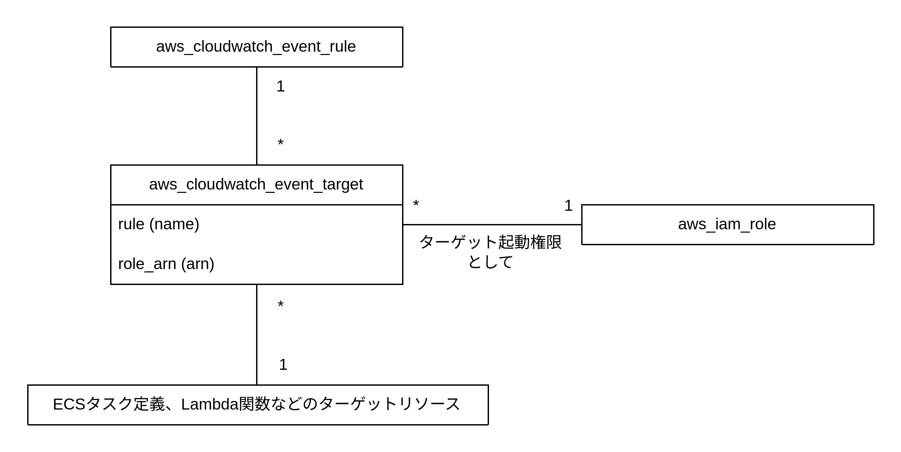

# EventBridge

イベントブリッジは cron 式や rate 式を使用して Lambda 関数や ECS タスクを実行できる。



## CloudWatch イベントルール

ジョブをいつ実行するかを定義する。

- cron 式: `cron(分 時 日 月 曜日 年)`のように記述する。ただし東京リージョンでも UTC で記述する必要がある。
- rate 式: `rate(2 minutes)`のように記述する。単位は「1 の場合は単数形、それ以外の場合は複数形」で記述する。よって`rate(1 hour)`や`rate(2 hours)`のように記述する。

```Terraform
resource "aws_cloudwatch_event_rule" "batch" {
  name = "batch"
  description = "important batch"
  schedule_expression = "cron(*/2 * * * ? *)"
}
```

## CloudWatch イベントターゲット

実行対象を定義する。ECS Scheduled Task の場合はタスク定義をターゲットに設定する。Lambda 関数の場合は Lambda 関数をターゲットに設定する。

- CloudWatch イベントルール
- IAM Role（ターゲットを起動するための IAM Role）
- ターゲット（ターゲッとの種類によって記述方法は変わる）

```Terraform
resource "aws_cloudwatch_event_target" "batch" {
  # CloudWatch イベントルール
  rule = aws_cloudwatch_event_rule.batch.name
  # IAMロール
  role_arn = aws_iam_role.ecs_events_role.arn

  # 以下ターゲットについて記述する（今回はECSタスク定義について記述する）
  target_id = "batch"
  arn = data.terraform_remote_state.ecs.outputs.cluster_arn

  ecs_target {
    task_count = 1
    task_definition_arn = aws_ecs_task_definition.example_batch.arn
    launch_type = "FARGATE"
    platform_version = "1.4.0"

    network_configuration {
      assign_public_ip = false
      subnets = data.terraform_remote_state.network.outputs.private_subnet_ids
    }
  }
}

resource "aws_iam_role" "ecs_events_role" {
  name = "ecs-events-role"
  assume_role_policy = data.aws_iam_policy_document.assume_cloudwatchevent.json
}

data "aws_iam_policy_document" "assume_cloudwatchevent" {
  statement {
    effect = "Allow"
    actions = ["sts:AssumeRole"]
    principals {
      type = "Service"
      identifiers = ["events.amazonaws.com"]
    }
  }
}

resource "aws_iam_role_policy_attachment" "cloudwathevent_role" {
  role = aws_iam_role.ecs_events_role.name
  policy_arn = data.aws_iam_policy.ecs_events_role_policy.arn
}

data "aws_iam_policy" "ecs_events_role_policy" {
  arn = "arn:aws:iam::aws:policy/service-role/AmazonEC2ContainerServiceEventsRole"
}
```

## ログ出力

ECS のタスク定義や Lambda 関数定義時に、CloudWatchLogs の設定をすることでログ出力の設定を行う。
