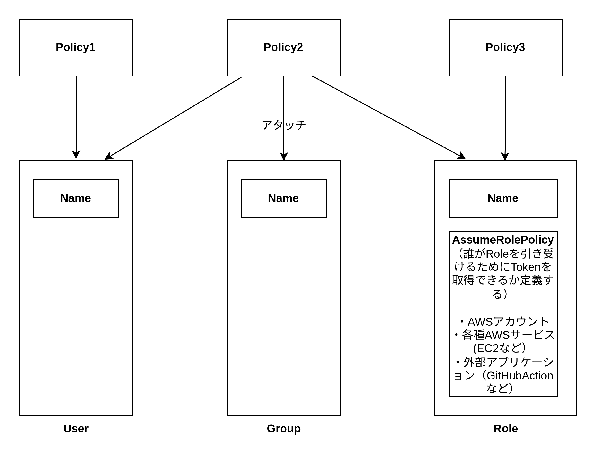
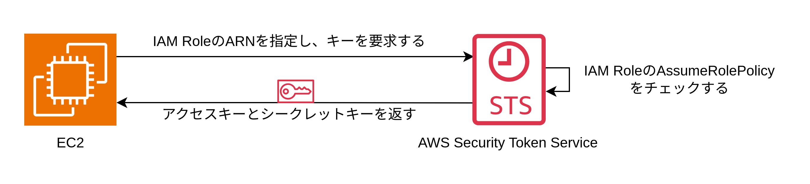

# IAM

IAM には以下の 3 種類のアイデンティティーが存在する。

- IAM ユーザー: 名前を持つ
- IAM グループ: 名前を持つ
- IAM ロール: 名前・AssumeRolePolicy（誰が Role を引き受けることができるかを定義した IAM ポリシー）を持つ

上記 3 種類に対して IAM ポリシーをアタッチして権限を付与する。

## IAM User

IAM User にポリシーをアタッチする際には aws_iam_user_policy と aws_iam_user_policy_attachment が使用できる

- aws_iam_user_policy: オリジナルのポリシーをアタッチするために使用される
- aws_iam_user_policy_attachment: 管理ポリシーをアタッチするために使用される

## IAM Group

IAM Group も IAM User とほぼ同じ

IAM Group にポリシーをアタッチする際には aws_iam_group_policy と aws_iam_group_policy_attachment が使用できる

- aws_iam_group_policy: オリジナルのポリシーをアタッチするために使用される
- aws_iam_group_policy_attachment: 管理ポリシーをアタッチするために使用される

## IAM Role

EC2 の Role 引き受けの流れ

1. EC2 が AWS STS に対して IAM Role を指定してアクセスキーとシークレットアクセスキーを要求する
2. STS は指定された IAM Role の AssumeRolePolicy 見て EC2 に Role を付与できるか確認する
3. EC2 に Role を付与できることを確認したらアクセスキーとシークレットアクセスキーを返す

IAM Role を引き受けることができるもの

- AWS のサービス(EC2・ECS など)
- OIDC プロバイダー（GitHubActions など）
- AWS アカウント

IAM Role にポリシーをアタッチする際には aws_iam_role_policy と aws_iam_role_policy_attachment が使用できる

- aws_iam_role_policy: オリジナルのポリシーをアタッチするために使用される
- aws_iam_role_policy_attachment: 管理ポリシーをアタッチするために使用される

