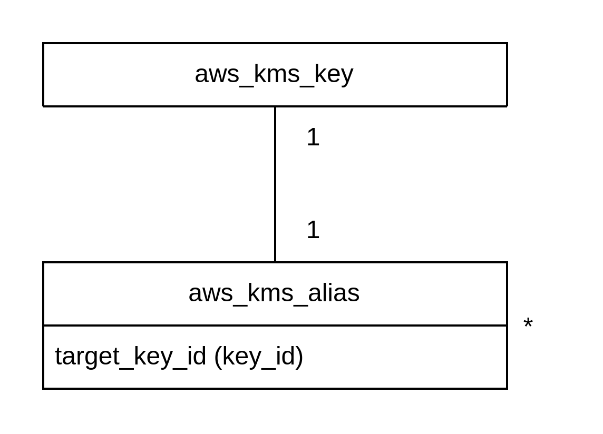
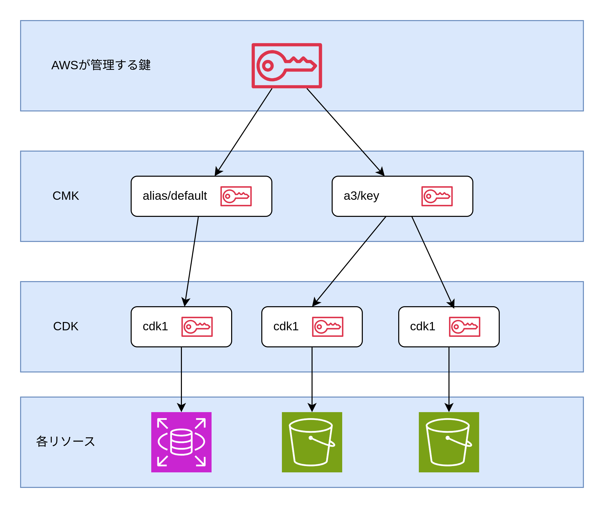

# KMS (Key Management Service)

- AWS が鍵を管理してくれるサービス
- ユーザーが独自に CMK を作成することもできるが、s3 や ssm パラメーターなどの AWS サービスが独自のマネージドな CMK を作成することもある（s3/key・alias/aws/ssm など）



## 暗号化の仕組み

- KMS で CMK（Customer Master Key）を作成して AWS 上の各リソースまたはローカル上に存在するファイルの暗号化ができる。
- AWS が管理する鍵で CMK を暗号化している
- CMK は CDK（Customer Data Key）を暗号化している
- AWS 上のリソースやローカル上のファイルの暗号化・復号化は CDK によって行われている
- つまり AWS の鍵管理は AES が管理する鍵・CMK・CDK の 3 重で実施されている
- s3 の CDK は各オブジェクトごとに作成される



## Terraform リソース

- aws_kms_key: CMK を作成する
  - 自動ローテーション
  - 有効化と無効化
  - 削除待機期間
- aws_kms_alias: CMK のエイリアス名を作成する
  - エイリアス名（`alias/`というプレフィックスが必要）
  - エイリアスを作成する CMK の ID

```Terraform
resource "aws_kms_key" "example" {
  description = "example customer master key"
  enable_key_rotation = true
  is_enabled = true
  deletion_window_in_days = 7
}

resource "aws_kms_alias" "example" {
  name = "alias/example"
  target_key_id = aws_kms_key.example.key_id
}
```
