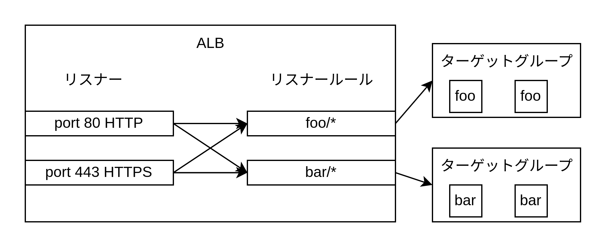
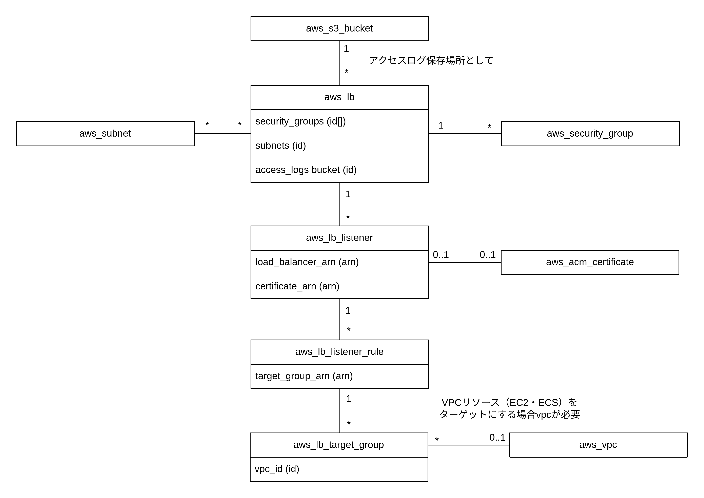

# ロードバランサー

- ロードバランサーは TCP/IP 層で動作する NLB とアプリケーション層で動作する ALB がある
- ロードバランサーは指定した AZ に負荷が高まると自動的にスケールアウトする

## ロードバランサーの構成

- ロードバランサー本体
- リスナー: 特定のポートとプロトコルでリッスンする
- リスナールール: リスナーに対するアクセスを受け取り、特定のパスやホスト名に一致したリクエストを指定したターゲットグループに送る
- ターゲットグループ: ローロバランサーからリクエストを受け取るサーバー群。サーバーに対するヘルスチェックも行う。

