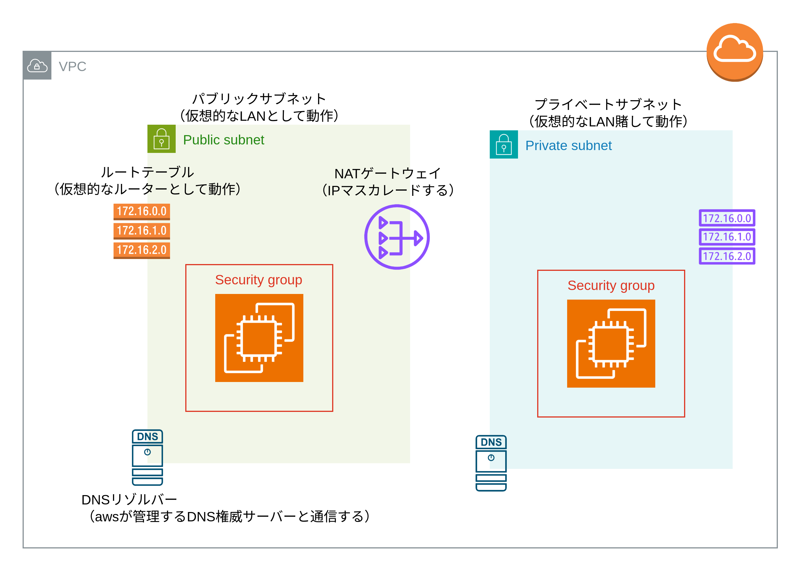

# AWS VPC

VPC には以下のリソースがある

- VPC
- インターネットゲートウェイ
- サブネット
- ルートテーブル
- NAT ゲートウェイ



## VPC

仮想的なネットワークを構築する。

```main.tf
resource "aws_vpc" "example" {
  cidr_block = "10.0.0.0/16"
  # AWSのDNS権威サーバーを使用する
  enable_dns_support = true
  # VPC内のインスタンスにDNSホスト名を付与する
  enable_dns_hostnames = true
  # enable_dns_supportとenable_dns_hostnamesをtrueに指定することでVPC内のインスタンスにプライベートDNS名が割り当てられ、対応するAレコードがAmazonが管理するDNS権威サーバーに作成される

  tags = {
    Name = "example"
  }
}
```

## インターネットゲートウェイ

VPC に属する。

```main.tf
resource "aws_internet_gateway" "example" {
  vpc_id = aws_vpc.example.id

  tags = {
    Name = "example"
  }
}
```

## サブネット

仮想的な LAN を構築する。  
VPC と AZ に所属する。

```main.tf
resource "aws_subnet" "public" {
  vpc_id = aws_vpc.example.id
  cidr_block = "10.0.0.0/24"
  map_public_ip_on_launch = true
  availability_zone = "ap-northeast-1a"

  tags = {
    Name = "public"
  }
}
```

## ルートテーブル

ルートテーブルは VPC に属する。ルートテーブルを作成すると VPC 内の通信を有効にするローカルルートが自動的に作成される。

```main.tf
resource "aws_route_table" "public" {
  vpc_id = aws_vpc.example.id
  tags = {
    Name = "public"
  }
}

resource "aws_route" "public" {
  route_table_id = aws_route_table.public.id
  gateway_id = aws_internet_gateway.example.id
  destination_cidr_block = "0.0.0.0/0"
}

resource "aws_route_table_association" "public" {
  subnet_id = aws_subnet.public.id
  route_table_id = aws_route_table.public.id
}
```

## セキュリティーグループ

インスタンスに付与するファイアーウォール。
