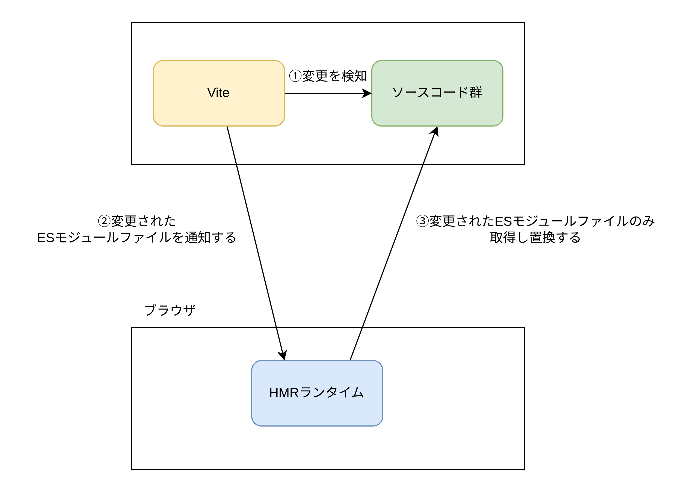

# 開発サーバー

ルートディレクトリを起点に静的ファイルサーバーを使用した場合とほぼ変わらない。

## NativeESModule とは

NativeESModule とは js ファイルをバンドルして 1 つのファイルにすることなく、`import宣言`と`export宣言`を使用して js ファイルを分割したままブラウザで JavaScript を利用すること。
Vite の開発サーバーはブラウザ上でも ESModule を使用している。Webpack の開発サーバーは js ファイルを 1 つにバンドルして配信している。Webpack の開発サーバーが ESModule を使用せず、バンドルを採用している理由は昔のブラウザは ESModule を理解できなかったためバンドルせざるを得なかったから。

### ネイティブ ESModule の利点

Webpack などの従来のバンドラベースの開発サーバーは、初回ビルド時に全てのファイルを 1 つにまとめなければならない。またソースコード更新時も一部のファイルが更新されただけなのに 1 つのファイルにまとめる必要があった。


Vite の開発サーバーは、ビルド後の成果物を複数ファイルモジュールのまま、ブラウザに直接読み込ませる。ソースコード更新時も 1 つのファイルを更新すると全てのソースコードを読み取ってバンドルし直すことなく 1 つのモジュールを置換すればよいだけなので高速に動作する。


### ネイティブ ESModule の欠点

ネイティブ ESModule の欠点は本番環境での使用が難しいことである。開発サーバーではネイティブ ESModule が使用されているが、本番ビルド時はファイルを 1 つにまとめるバンドルが使用されている。開発時は ESModule ファイル取得時にローカルホストからダウンロード可能なのでダウンロードに時間がかからない。しかし本番環境ではたくさんの ESModule ファイルをネットワーク越しにダウンロードすることになる為非常に時間がかかる。よって本番ビルド時はファイルを 1 つにまとめるバンドルが採用されている。

## npm の事前バンドルと依存関係解決

事前バンドル

- ライブラリの事前バンドルは`esbuild`によって実行される
- CommonJS（node.js で使用される`require`のような構文）を ESM に変換する
- node_modules/.vite/deps 以下にライブラリごとにバンドルされたファイルが配置される
- ライブラリごとにファイルをバンドルすることで読み込みファイル数を減らす

依存関係解決

- ライブラリの`import文`を`node_modules/.vite/deps/vue.js`のように書き換えることでブラウザが正しくモジュールをインポートできるよう書き換える

```TypeScript
import { createApp } from 'vue'
// 下記のようにViteがソースコードを置換する
import { createApp } from 'node_modules/.vite/deps/vue.js'
```

FileSystem キャッシュ

Vite は`node_modules/.vite/deps`に事前バンドル済みの依存関係をキャッシュする。以下のソースに基づいて事前バンドルを再実行する必要があるかどうかを決定する。

- パッケージマネージャーのロックファイル: package-lock.json,yarn.lock,pnpm-lock.yaml
- `NODE_ENV`の値

ブラウザキャッシュ

事前バンドルされたライブラリのファイルは`HTTPヘッダー: max-age = 31536000, immutable`で積極的にキャッシュされる。

## HMR（HotModuleReplacement）

HMR は開発サーバー起動中にソースコードを書き換えた場合に、変更された ES モジュールファイルのみ配信することで効率化する手法。HMR は Websocket 通信とソースコードに注入された`Runtime`と呼ばれるスクリプトによって実現される。ソースコードの変更を Vite が検知すると、Websocket でブラウザに通知し、通知を受け取ったブラウザ上で動作している`Runtime`が変更された ES モジュールファイルを取得して ES モジュールを置換する。



## TypeScript

TypeScript のトランスパイルは`esbuild`によって実施される。esbuild は型チェックは行わず ts ファイルから js ファイルへの変換のみ実施する。

### Vite の型

Vite は Node.js での API を提供する。Vite が提供する API の型情報は`node_modules/vite/index.d.ts`に存在する。`/// <reference type="vite/client" />`を使用するか、`tsconfig.json`ないの`compilerOptions.types`に`vite/client`を追加することで VIte の型情報を TypeScriptCompiler に読み込ませることができる。

```TypeScript
/// <reference types="vite/client" />
```

tsconfig.json

```tsconfig.json
{
  "compilerOptions": {
    "types": ["vite/client"]
  }
}
```

`node_modules/vite/index.d.ts`を読み込むと以下の型情報が追加できる。

アセットのインポート（例 `.csv`ファイルのインポート）

```TypeScript
// ESModuleを宣言している
declare module '*.module.css' {
  const classes: CSSModuleClasses
  export default classes
}
```

`import.meta`に Vite がデフォルトで追加するプロパティー

```TypeScript
interface ImportMeta {
  url: string // ブラウザに標準で追加されている唯一のプロパティー

  readonly hot?: import('./hot').ViteHotContext

  readonly env: ImportMetaEnv

  glob: import('./importGlob').ImportGlobFunction
}
```
