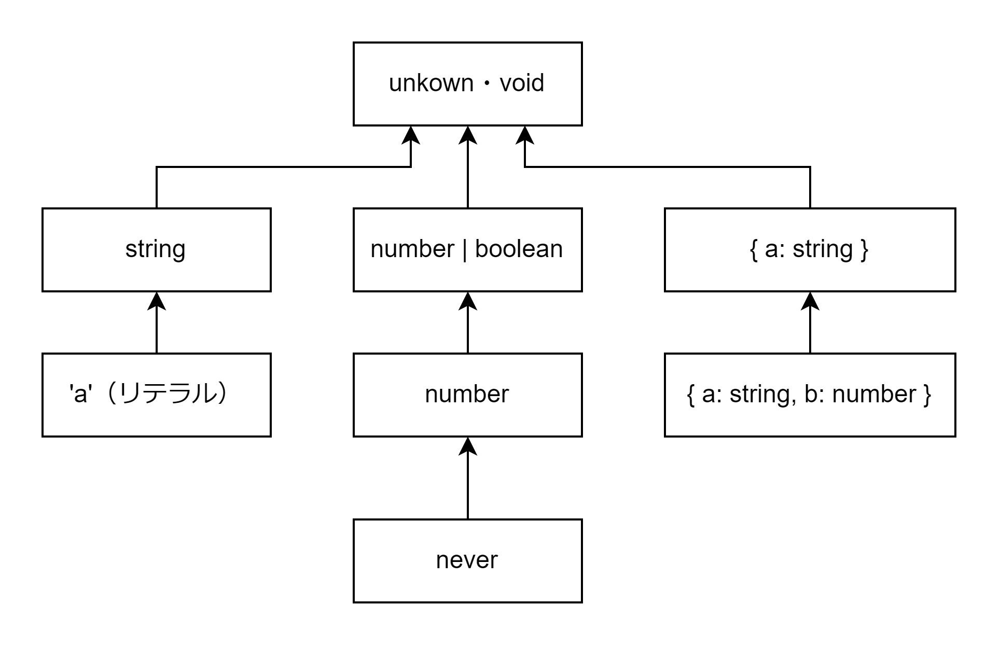

# TypeScript の型まとめ

## 型階層

- TypeScript の最上位の基底型は unknown。よって unknown 型の変数にはどんな型の値でも代入可能。
- TypeScript の最下層の型は never。よって never 型の変数にはどんな方の値も代入不可。
- void も TypeScript の最上位の基底型。ただし void は関数の返り値としてしか使用できない。よって void を返り値とする関数はどんな型でも返り値にできる。
- オブジェクトの場合は{a: string}の部分型は{a: string, b: number}のように string 型のプロパティー a を含むオブジェクトであればよい。クラスの親子関係のように子クラスには追加でインスタンス変数やメソッドを追加できるような感じ。



```TypeScript
const fn = (obj: {a: string}) => {
  console.log(obj)
}
const obj = {a: 'a', b: 'b'}
// OK
fn(obj)
// エラー: 変数に代入してから引数として渡さないとエラーになる
fn({a: 'a', b: 'b'})

// unknownにはどんな値でも代入可能
const a: unknown = 'a'
// エラー: neverにはどんな値も代入不可
const b: never = 'a'
```

## never 型

- TypeScript の最下層の型
- union distribution 時に 0 個の union 型としてふるまう

```TypeScript
// neverは0個のunion型なのでunion distributionするとnever extends neverが実行されないのでnever型になる
type isNever<T> = T extends never ? true : false
// [T]とするとunion distributionが実施されず[never] extends [never]が実行されるのでtrueになる
type isNever<T> = [T] extends [never] ? true : false
```

## union 型

プロパティーのリテラル値が異なる union の場合、プロパティーの値で条件分岐するとどのオブジェクトかを見分けることができる。

```TypeScript
type A =
  | {
      type: 'one'
      one: 1
    }
  | {
      type: 'two'
      two: 2
    }

const getNum = (a: A) => {
  if (a.type === 'one') {
    // A.type = 'one'の場合、{ type: 'one', one: 1 }と判別できる
    return a.one
  }
  // A.type = 'two'の場合{ type: 'two', two: 2 }と判別できる
  return a.two
}
```

## intersection 型

```TypeScript
type A = {a: string}
type B = {a: number, b: number}
// C = { a: string & number, b: number }
type C = A & B
```

## 関数の union 型

関数同士の union 型は引数の型は intersection 型になり、返り値の型は union 型になる。引数が intersection 型になるのは関数内で string 型特有のメソッドまたは number 型特有のメソッドを使用する可能性があるため string 型と number 型の両方の性質を持つ必要があるため string 型と number 型の intersection 型である必要がある。

```TypeScript
type StrFn = (arg: string) => string
type NumFn = (arg: number) => number

// StrNumFn = (arg: string & number) => string | number
type StrNumFn = StrFn | NumFn
```

```TypeScript
type StrObjFn = (arg: {a: string}) => string
type NumObjFn = (arg: {b: number}) => number

// StrNumFn = (arg: { a: string, b: number }) => string | number
type StrNumFn = StrObjFn | NumObjFn
```

## Tuple 型

タプル型の中に...配列と書くことができる。...型変数の形で使うことができ、型推論の材料にできることです。

```TypeScript
const removeFirst = <T, Rest extends unknown[]>(arg: [T, ...Rest]): Rest => {
  const [_, rest] = arg
  return rest
}
```

## テンプレートリテラル型

テンプレートリテラルの中に${ 型 }という構文を入れることができる

```TypeScript
type fontSize = `${number}px`
```

## as const

as const を使用することでオブジェクトのプロパティーを readonly かつリテラル値として型推論させることができる。

```TypeScript
// リテラル値として型推論する
// {
//   readonly man: '1',
//   readonly woman: '2',
//   readonly other: '3',
// }
const Sex = {
  man: '1',
  women: '2',
  other: '3'
} as const
```

## object 型と{}

- object 型
  - プリミティブな値以外のすべてのオブジェクトを受け入れる
- {}型
  - オブジェクトもプリミティブ値もすべて受け入れるため使用しない

```TypeScript
// エラーになる
const a: object = 'a'
// エラーにならない
const b: {} = 'b'
```

## typeof

`typeof 変数`と書くことで型を取得できる

```TypeScript
const a = 'a'
// TypeOfAはstring型になる
type TypeOfA = typeof a
```

## keyof

`keyof T`は「T のプロパティー名の union 型」

```TypeScript
// 'foo' | 'bar'
type A = keyof { foo: 'a', bar: 'b' }
// lengthメソッドなどの配列のプロパティーのunion型
type B = keyof []
```

## Looks Types `T[K]`

```TypeScript
type MyObj = { foo: string }
// string型になる
type A = MyObj['foo']
```

## Mapped Types

```TypeScript
// { foo: string, bar: string }になる
type MyObj = { [P in 'foo' | 'bar']: string }
// オブジェクトのすべてのプロパティーから?を取り外す
type Required<T extends object> = { [P in keyof T]-?: T[P] }
```

## Conditional Types

`T extends U ? X : Y`という三項演算子のような記法。T が U の部分型である場合、X を返却し、そうでない場合 Y を返却する。Conditional Types は以下のような使い道がある。

- 再帰関数
- infer を用いた型マッチング
- infer を用いた文字列操作

```TypeScript
type DeepReadOnly<T> = T extends object
  ? { readonly [P in keyof T]: DeepReadOnly<T[P]> }
  : T
```

```TypeScript
type ReturnType<T> = T extends (...args: unknown[]) => infer R ? R : never
```

```TypeScript
type ExtractHelloPart<T extends string> = T extends `Hello, ${infer R}` ? R : never
// type A = World
type A = ExtractHelloPart<'Hello, World'>
```

## union distribution(union の分配)

裸の型変数が union 型の場合に conditional types を使用すると(A extends T ? X : Y | B extends T ? X : Y)のように 2 回 conditional types の計算が行われて計算結果の union 型になる。

```TypeScript
type None = { type: 'none' }
type Some<T> = { type: 'some'; value: T }
type Option<T> = None | Some<T>

type ValueOfOption<T extends Option<unknown>> = T extends Some<infer R>
  ? R
  : undefined

// (None extends Some<infer R> ? R : undefined) | (Some<number> extends Some<infer R> ? R : undefined)が実行されるため type A = undefined | number
type A = ValueOfOption<Option<number>>
```

```TypeScript
// [T]のように裸の型変数を使用していないのでTにunion型を渡してもunion distributionは起こらない
type ValueOfOption<T extends Option<unknown>> = [T] extends [Some<infer R>]
  ? R
  : undefined

// [None | Some<number>] extends [Some<infer R>] ? R : undefinedが実行されるので type A = undefinedになる
type A = ValueOfOption<Option<number>>
```

## 配列の要素型の取得

配列の要素の型を取得するには`Array[number]`を使用する。

```TypeScript
type Array = (string | number)[]
// type A = string | numberになる
type A = Array[number]
```

## enum

オブジェクトリテラルを用いて enum として使用する。

```TypeScript
const animal = {
  monkey: '1',
  tiger: '2'
} as const

// '1' | '2'
type Animal = typeof animal[keyof typeof animal]
```
