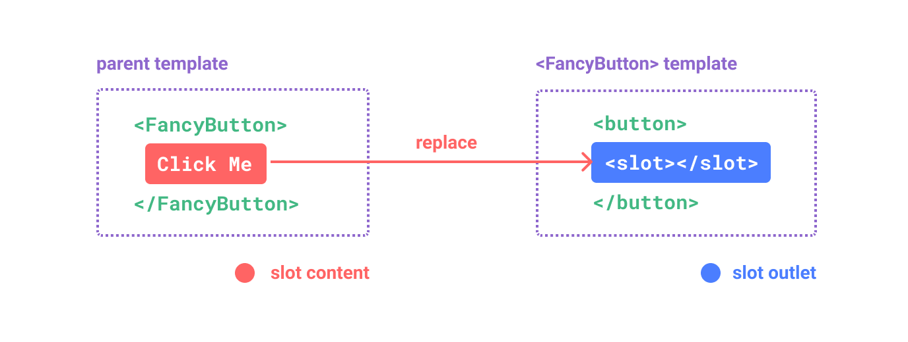

# スロット

スロットは親コンポーネントから HTML テンプレートを子コンポーネントに渡すことができる機能。

親コンポーネント

```HTML
<template>
  <FancyButton>
    Click me!
  </FancyButton>
</template>
```

子コンポーネント

```HTML
<template>
  <div>
    <!-- slot要素に親コンポーネントから渡されたClick me!要素を埋め込む -->
    <slot />
  </div>
</template>
```



## スロットコンテンツがアクセスできる変数

- スロットコンテンツは親コンポーネントで定義されるので、子コンポーネントで定義された props や ref オブジェクトにアクセスできない
- スロットコンテンツは自コンポーネントの props や ref オブジェクトにはアクセス可能

```Vue
<script setup lang="ts">
const { btnText } = ref('FancyButton')
</script>

<template>
  <!-- 自コンポーネントの変数にはアクセスできるが、子コンポーネントで定義された変数にはアクセス不可 -->
  <FancyButton>
    {{ btnText }}
  </FancyButton>
</template>
```

## デフォルトコンテンツ

親コンポーネントからスロットコンテンツが渡されない場合に、子コンポーネントで定義したデフォルトコンテンツを表示可能。

```HTML
<template>
  <button class="fancy-button">
    <!-- 親コンポーネントからスロットコンテンツが渡されない場合、デフォルトコンテンツという文字列が表示される -->
    <slot>
      デフォルトコンテンツ
    </slot>
  </button>
</template>
```

## 名前付きスロット

スロットに名前を付与することで、子コンポーネントに複数のスロットを定義可能。

子コンポーネント

```HTML
<template>
  <div>
    <!-- header・main・footerの3つのスロットを定義した -->
    <div class="header">
      <slot name="header" />
    </div>

    <div class="main">
      <slot name="main" />
    </div>

    <div class="footer">
      <slot name="footer" />
    </div>
  </div>
</template>
```

親コンポーネント

```HTML
<template>
  <div>
    <MyComponent>
      <!-- #headerまたはv-slot:headerのように名前付きスロットコンテンツを定義する -->
      <template #header>
        <header>ヘッダー</header>
      </template>

      <template #main>
        <main>ヘッダー</main>
      </template>

      <template v-slot:footer>
        <footer>ヘッダー</footer>
      </template>
    </MyComponent>
  </div>
</template>
```

## 条件付きスロット

- 親コンポーネントからスロットコンテンツが渡された場合のみ DOM をレンダリングすることが可能
- `v-if`と`$slots`を組み合わせることで実現できる

子コンポーネント

```HTML
<template>
  <!-- v-if="$slots.header"のようにして表示・非表示を切り替える -->
  <div>
    <div v-if="$slots.header">
      <slot name="header" />
    </div>

    <div v-if="$slots.default">
      <slot />
    </div>

    <div v-if="$slots.footer">
      <slot name="footer" />
    </div>
  </div>
</template>
```

## スコープ付きスロット（子コンポーネントから親コンポーネントに変数を渡す）

子コンポーネントから親コンポーネントにスロットコンテンツ内でのみ使用できる変数を渡すことが可能。

親コンポーネント

```HTML
<template>
  <FancyList :posts="posts">
    <!-- デフォルトスロットコンテンツ内でのみ使用可能なpostオブジェクトを子コンポーネントから受け取る -->
    <template v-slot="post">
      ID: {{ post.id }}<br />
      Title:  {{ post.title }}<br />
      Content: {{ post.content }}
    </template>
  <FancyList>
</template>
```

子コンポーネント

```VUe
<script setup lang="ts">
const props = defineProps<{
  posts: {
    id: number
    title: string
    content: string
  }[]
}>()
</script>

<template>
  <ul>
    <li v-for="post in posts" :key="post.id">
      <!-- postオブジェクトを親コンポーネントに渡す -->
      <slot v-bind="post" />
    </li>
  </ul>
</template>
```

## まとめ

- スロットを利用して親コンポーネントから子コンポーネントに HTML を渡すことができる
- 親コンポーネントのスロットコンテンツ内から子コンポーネントの変数は利用できない（スコープ付きスロットを使用する必要がある）
- 子コンポーネントの`<slot>`要素内にデフォルトコンテンツを定義できる
- 名前付きスロットを利用して複数のスロットを定義できる
- 条件付きスロットを利用して親コンポーネントからスロットコンテンツが渡された場合のみ DOM を表示することができる
- スコープ付きスロットを利用して子コンポーネントから親コンポーネントに変数を渡すことができる
