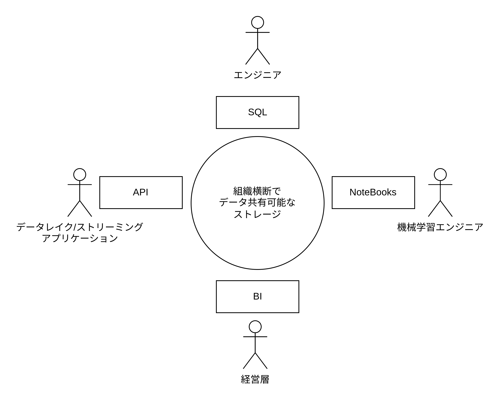
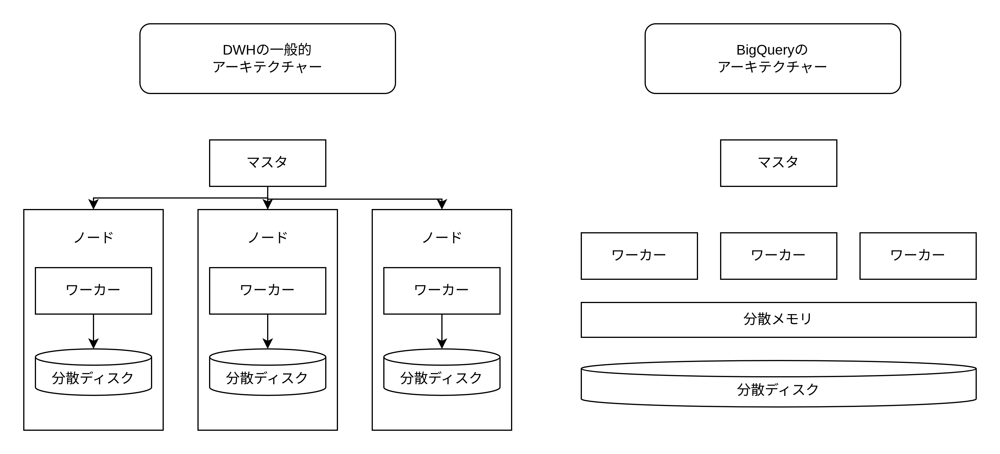
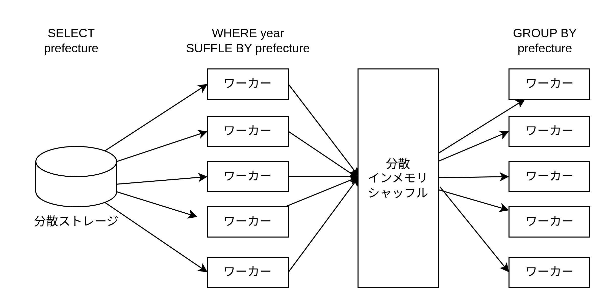

# BigQuery

BigQuery は GCP 上で使用できるサーバーレスの DWH である。

## BigQuery の機能

- 標準 SQL による分析
- 機械学習
- BI ツールによる分析
- データのストリーミング挿入
- API を利用したデータの CRUD 操作

## BigQuery のアーキテクチャー

- コンピュート、ストレージ、メモリの分離
- 上記それぞれのスケールアウト（分散コンピューティング）
- 列指向
- マルチテナント
- 「クラスター」の概念のない管理
- 共有ストレージによるサイロ化の解消

### マスターノード

- クエリの構文を解析し、クエリプランを構築する
- BigQuery のリソースをスケジューリングする

### ワーカーノード

- クエリプランに基づいて、数百〜数万台のワーカーによる分散処理を行う（実態はコンテナでクエリを実行する際に起動し、狩猟すると破棄される）
- ワーカー上のコンピュートユニットをスロットと呼ぶ
- マルチテナント方式なので、他社 BigQuery ユーザーが多い場合は、使用可能なワーカーノードが少なくなる
- BigQuery Reservations 機能ではスロットを専有して定額で利用可能

### ネットワーク

- ワーカーノード、分散インメモリシャッフル、分散ストレージ間をつなぐ高速ネットワーク

### 分散インメモリシャッフル

- ワーカー間におけるデータ移動する処理（シャッフル）を効率的に行うため全ワーカー共通のメモリ
- Go の各ゴルーチン間のデータをチャネルでやり取りする処理 = シャッフル
- GROUP BY を行う際に特定のキーワードを特定のワーカーに寄せるなどの処理 = シャッフル

### 分散ストレージ

- 複数のゾーンにまたがり自動的にレプリケーションされて保管される
- コンピュート、メモリ、ストレージが完全に分離されているのでそれぞれを独立にスケーリング可能
- 追記とスキャンに特化したストレージであるため、DWH の用途である「貯める、変更しない、消さない」という用途にパフォーマンスが最適化されている
- データは Capacitor ファイルという列指向のファイルフォーマットにデータを圧縮している。行指向データベースと比べて高速にスキャンできる
- 分散ストレージはマルチテナント方式なので、どの BigQuery 環境からでもリージョンが同じなら同じストレージを見るため、サイロ化しない

## BigQuery のリソース

1. プロジェクト: 複数のデータセットの集合体
2. データセット: 複数のテーブルの集合体
3. テーブル: クエリの対象となるデータを保持する最小の単位

## クエリの最適化

### 1. 必要なカラムのみ取得する

BigQuery は列指向のデータベースなので、`SELECT`文で選択されたカラムのみをスキャンしクエリを実行する。よって不必要なカラムは`SELECT`しないことでパフォーマンスを向上させられる。

### 2. パーティション分割・クラスタ化を利用する

BigQuery には、パーティション分割・クラスタ化という、スキャンするカラムだけでなく行を絞り込む機能がある。日付列をパーティション分割して`WHERE`句で絞り込むとパフォーマンスを向上させられる。  
また、`CREATE TABLE`ステートメントでテーブルを作成する際に、パーティションを分割する`PARTITION BY column_name`とともに、`OPTIONS`節で`require_partition_filter=true`を設定するとパーティション対象カラムに対する`WHERE`句を必須にできる。

### 3. クエリ結果のキャッシュと明示的なテーブル指定による永続化を利用する

BigQuery では、クエリの結果は全てのテーブルとして結果が書き込まれる。テーブルには以下の 2 種類がある。

1. 一時的なキャッシュ結果テーブル
   - デフォルトで利用される
   - クエリを実行すると自動で`一時領域`にクエリ結果を`一時テーブル`としてキャッシュする
   - 再度同じクエリを実行すると一時テーブルが利用される
   - クエリ対象テーブルがクエリ後に変更される・`CURRENT_TIMESTAMP()`などの一位に定まらない関数を使用している場合はキャッシュを利用できない
2. 宛先テーブル
   - クエリの結果を`永続領域`に`テーブル`として保存する
   - `CREATE TABLE SELECT AS`とすると宛先テーブルを作成できる
   - データマートを作成する目的でも使用可能

### 4. クエリプランの可視化

BigQuery では事項したクエリに対する実行計画（クエリプラン）が提供されているのでそれを読み解くことでクエリを高速化できる。
