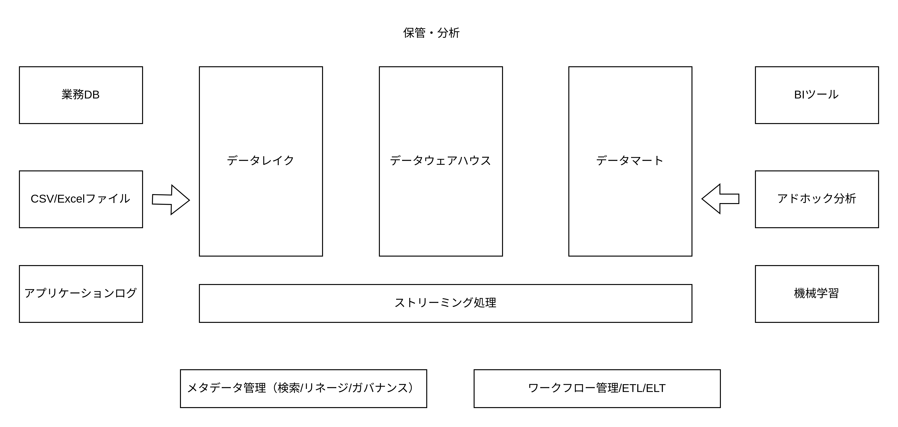

# データ分析基盤

データ分析基盤には以下の 3 要素が求められる。

1. データをリアルタイムに使用できる
2. 変化に迅速に対応できる
3. データを部門を超えて全社最適で活用できる

例えば、各店舗ごとにエクセルで集計し、週に一度、各店舗ごとに作成された RDB に CSV ファイルを取り込み、データマート（集計テーブル）を作成している場合。

1. 週に一度 CSV ファイルを取り込むため、リアルタイムなデータ分析ができない
2. データマートを使用した集計結果は取得可能だが、それ以外の集計を行おうとするとインデックスで最適化してから集計を行う必要がある
3. 各部門ごとに RDB が作成されて集計されているため、全社最適でデータを活用できない

上記を解決するために以下の施策を取ることができる。

1. Excel ではなく業務システムを使用することでリアルタイムにデータを収集し、データウェアハウス/データレイクにデータを格納する
2. データウェアハウスを活用することで、インデックスを使用せずアドホックな分析を実現する
3. 全社共通の業務システム または Excel のフォーマットを統一してデータレイク/データウェアハウスにデータを格納 または それぞれフォーマットが異なる Excel ファイルをデータレイクに格納し日時バッチなどで ETL/ELT で統一したデータフォーマットに整形し、データウェアハウスに格納する

## GCP

| データ基盤のコンポーネント名                    | GCP 上のプロダクト、サービス名                   |
| :---------------------------------------------- | :----------------------------------------------- |
| データレイク                                    | CloudStorage・BigQuery（構造化データ）・Dataproc |
| データウェアハウス                              | BigQuery                                         |
| ストリーミング処理                              | Pub/Sub・DataFlow                                |
| データパイプライン（ワークフロー管理・ETL/ELT） | Data Fusion・Data Flow・Dataproc・Composer       |
| メタデータ管理                                  | Data Catalog                                     |
| BI ツール                                       | Looker                                           |
| 発展的な分析                                    | BigQuery GIS                                     |
| 機械学習                                        | BigQuery ML・Cloud AI Platform                   |

DataFlow: Apache Beam（バッチ処理）  
DataProc: Apache Hadoop/Spark（分散処理）
