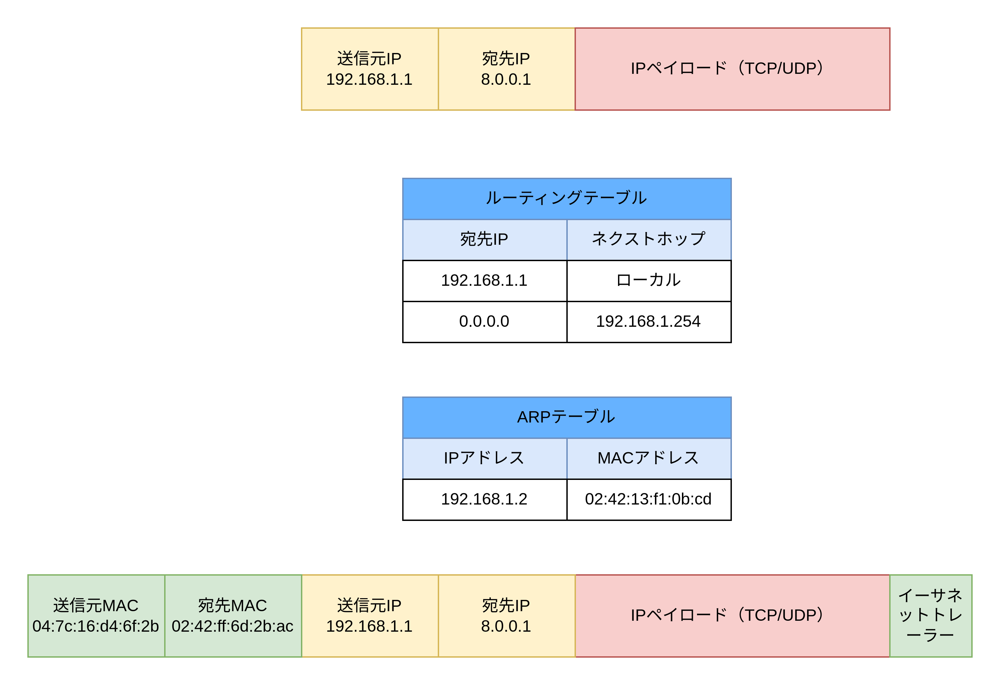
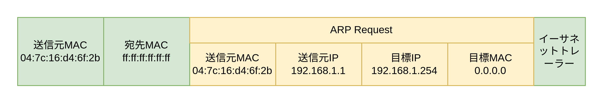

# ARP

## ARP とは

- ARP はレイヤー 2（データリンク層）のプロトコル
- 宛先 IP アドレスの MAC アドレスを求めるためのプロトコル
  - 例えば 192.168.1.1 の MAC アドレスを使用するために利用される
- LAN 内でのパケットの配送は IP アドレスではなく MAC アドレスをもとに行われるため IP アドレスから MAC アドレスを求める必要がある

## ARP を利用する場合の流れ

1. OS が IP パケットの宛先 IP アドレスとルーティングテーブルを突き合わせてネクストホップの IP アドレスを取得する
2. ネクストホップの IP アドレスの MAC アドレスを ARP テーブルから取得する
3. ARP テーブルに ARP エントリーが存在しない場合はネクストホップの ARP Request を LAN 内のすべての端末にブロードキャストする
4. ARP Request を受け取った端末は目標 IP アドレスが一致している場合に ARP レスポンスを返却する。同時に送信元 IP アドレス・送信元 MAC アドレスから ARP エントリーを作成する

## 実際の流れ

1. 宛先 IP アドレスをルーティングテーブルで検索すると、デフォルトルート（0.0.0.0）似一致するためネクストホップを 192.168.1.254 にする
2. ネクストホップ IP アドレス（192.168.1.254）の MAC アドレスを ARP テーブルから取得する。ARP テーブルにエントリーが存在しないため ARP リクエストをブロードキャストする
3. ARP リクエストパケットを受けっとた LAN 内の端末の目標 IP アドレスが自身の IP アドレスと一致する場合 ARP リプライを返信する。また送信元 IP アドレスと送信元 MAC アドレスから ARP エントリーを作成する
4. 返却された ARP リプライから宛先 MAC アドレスを確定し IP パケットにイーサネットヘッダーとイーサネットトレーラーを追加する

## ARP のフレームフォーマット

ARP は LAN 内の端末の IP アドレスから MAC アドレスを引くためのプロトコルなので ARP パケットはイーサネットペイロードに挿入される

