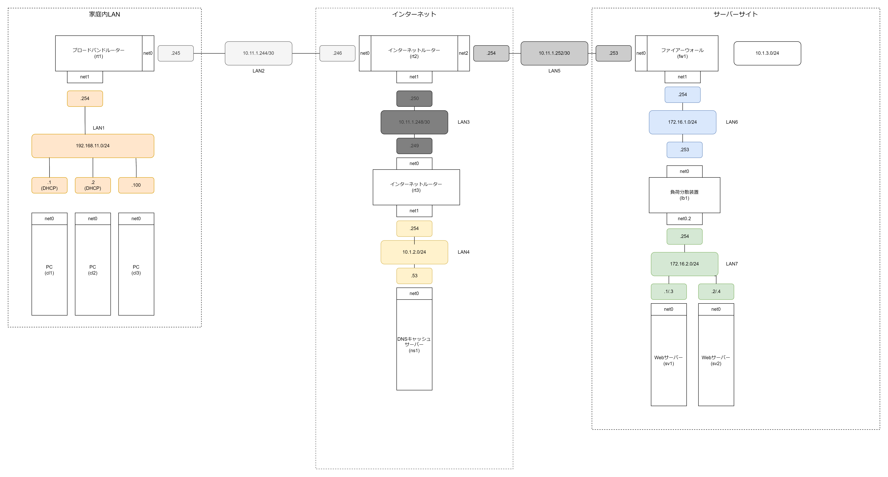
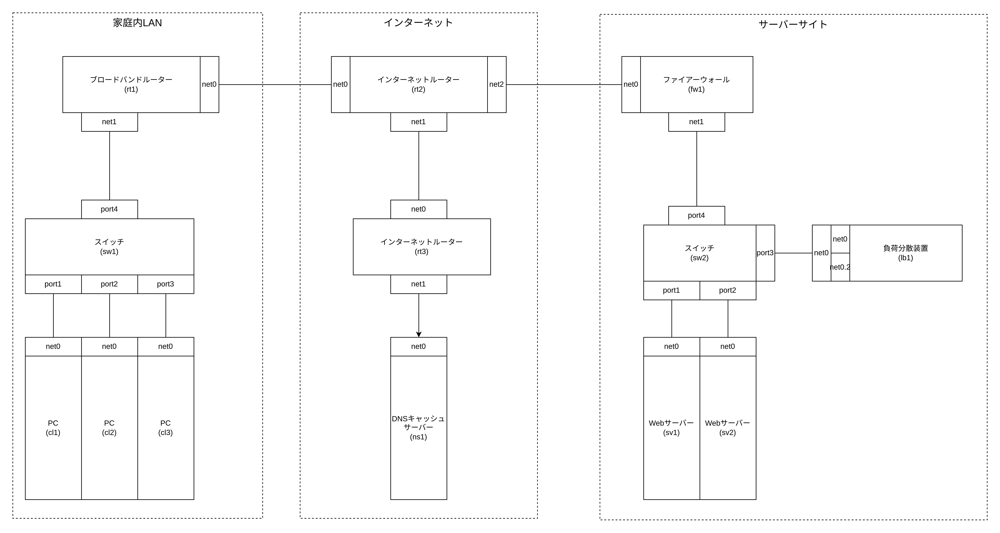
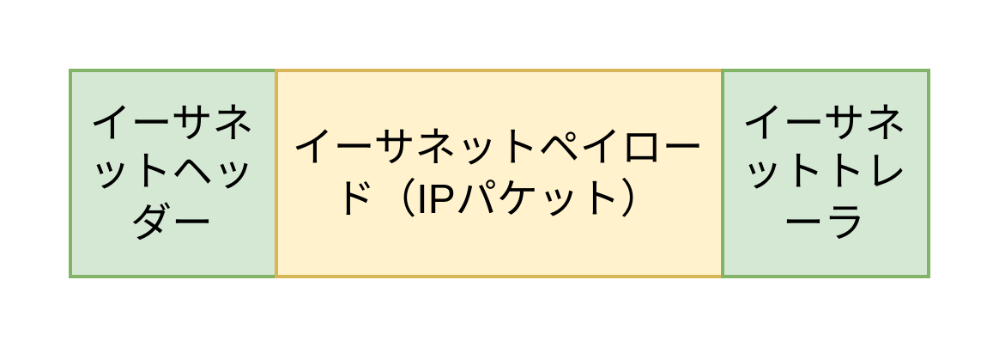

# イーサネット

## 論理構成図

## 物理構成図

## イーサネットとは

- LAN 内のイーサネットパケットの配送を実際に行う
  - たとえば 192.168.0.1/24 の LAN 内では 192.168.0.1/24 内へのパケット配送のみを行う
  - 外部ネットワーク との通信にはレイヤー 2 プロトコルのイーサネットだけでなくレイヤー 3 プロトコル の IP が必要になる（逆に言うと 同一ネットワーク内の通信はレイヤー 2 プロトコルのイーサネットだけが必須であり、レイヤー 3 の IP は必須ではない）
- イーサネットトレーラのチェックサム（イーサネットヘッダー + イーサネットヘッダー）をもとにイーサネットフレームが壊れていないかを確認する
- LAN 内の端末の識別 ID には MAC アドレスを使用する

## イーサネットフレームのフォーマット

- イーサネットヘッダー
  - 宛先 MAC アドレス
  - 送信元 MAC アドレス
  - タイプ（イーサネットペイロードのタイプで基本的には IPv4 か IPv6 になる）
- イーサネットペイロード
  - ペイロードは IP パケットになる。HTTP パケットの場合、ペイロードは IP+TCP+SSL/TLS+HTTP になる。
- イーサネットトレーラー
  - イーサネットヘッダーとイーサネットペイロードのチェックサム。パケットが壊れていないかを確認するためのチェックサム。

## MAC アドレス

- MAC アドレスは LAN に接続している端末の識別 ID
- MAC アドレスは NIC（ネットワークインターフェースカード）に物理的に書き込まれている
- 6 バイト（48 ビット）で構成される　例）04:7c:16:d4:6f:2b
- ブロードキャスト MAC アドレス: ff:ff:ff:ff:ff:ff
- MAC アドレスはデータリンク層でのアドレス（ネットワーク層でのアドレスは IP アドレス）
