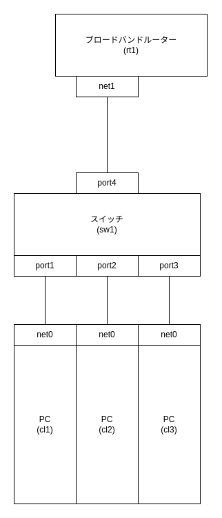

# L2 スイッチ

## L2 スイッチとは

L2 スイッチはポートを持ちポートには LAN ケーブルで各端末の NIC が接続される。スイッチに接続された各端末の MAC アドレスとポート番号を管理することで通信を効率化することができる

## L2 スイッチのパケット転送の流れ

1. イーサネットフレームを作成して LAN ケーブルに流す
2. スイッチは送信元 MAC アドレスとポート番号を MAC テーブルにレコードとして登録する
3. スイッチは MAC アドレステーブルを参照して宛先 MAC アドレスに一致するレコードが存在する場合は対象のポートにパケットを流す。レコードが存在しない場合は送信元端末以外の全ての端末にパケットを送信する（フラッティング）
4. パケットを受け取った端末は宛先 MAC アドレスが一致している場合にパケットを受け取る

