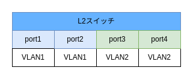
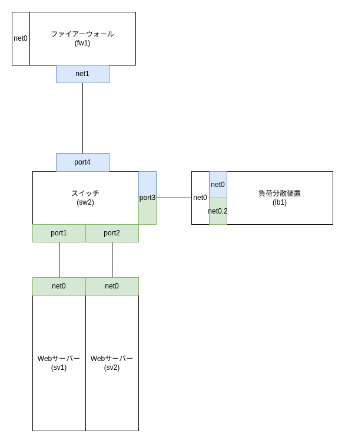
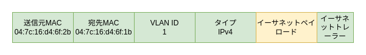

# VLAN

## VLAN とは

1 台のスイッチで複数の LAN（ローカルエリアネットワーク）を作成する技術。L2 スイッチの各ポートに VLAN ID を設定し、異なる VLAN ID にはパケットを流さないようにすることで仮想的に複数の LAN を分離している

## ポート VLAN

各ポートに VLAN ID を設定することで異なる VLAN ID 同士はパケットのやり取りができないようにする



## タグ VLAN

タグ VLAN はイーサネットフレームに VLAN タグとして VLAN ID などを付与できる技術。タグ VLAN を用いると 1 つのポートで複数の VLAN ID のパケットを処理できるようになる。イーサネットフレームに VLAN ID が存在しない場合はネイティブ VLAN として設定した VLAN ID のイーサネットフレームとみなす。

```bash
ovs-vsctl set port3 vlan_mode=native-untagged trunks=2 # タグVLANとしてVLAN ID=2を設定し、ネイティブVLANとしてport3に設定されているもともとのVLAN IDとする
ip link add link eth0 name eth0.2 type vlan id 2 # タグVLAN 2のインターフェースを作成する
ip addr add 172.16.2.254/24 dev eth0.2
```



