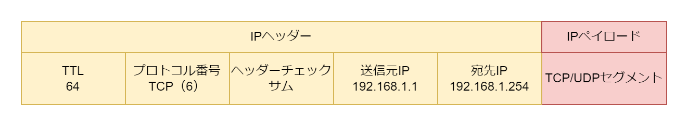

# IP

## IP の役割

IP は異なる LAN セグメント間の通信を可能にするプロトコル。同一 LAN 上の端末間での通信はイーサネットが行う。

## IP パケットのフォーマット

- IP パケットは IP ヘッダー+IP ペイロードから構成される
- TTL はルーターを経由するたびに 1 つずつ減らされ、0 になると ICMP TTL Exceed パケットを返却する
- プロトコル番号は IP ペイロードのプロトコル番号
- 送信元 IP アドレスと宛先 IP アドレスを持つ
- IP ペイロードはレイヤー 4 以降の TCP/UDP・HTTP・DHCP などのプロトコルのパケット

## IP アドレス

プライベート IP アドレス

| CIDR 表記      | サブネットマスク |
| :------------- | :--------------- |
| 10.0.0.0/8     | 255.0.0.0        |
| 172.16.0.0/12  | 255.240.0.0      |
| 192.168.0.0/16 | 255.255.0.0      |

デフォルトルートアドレス: 0.0.0.0/0  
ネットワークアドレス: ホスト部がすべて 0 のアドレス 例）192.168.1.0/24 の場合は 192.168.1.0。  
ブロードキャストアドレス: ホスト部がすべて 1 のアドレス 例）192.168.1.0/24 の場合は 192.168.1.255。  
ループバックアドレス: 127.0.0.0/8。127.0.0.1/8 がループバックアドレスとして使用されることが多い。
