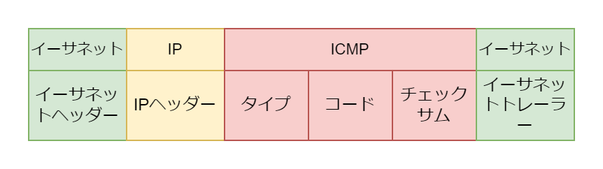

# ICMP (Internet Control Message Protocol)

## ICMP とは

IP プロトコルのトラブルシューティングとして使用されるプロトコル。IP 層の通信の確認、IP に関するエラー通知として利用される。

## ICMP パケットのフォーマット

ICMP は IP ペイロードに配置される

<table>
  <tr>
    <th colspan="2">タイプ</th>
    <th colspan="2">コード</th>
    <th>意味</th>
  </tr>
  <tr>
    <td>0</td>
    <td>Echo Reply</td>
    <td>0</td>
    <td>Echo Reply</td>
    <td>エコー応答</td>
  </tr>
  <tr>
    <td rowspan="4">3</td>
    <td rowspan="4">Destination Unreachable</td>
    <td>0</td>
    <td>Network Unreachable</td>
    <td>宛先ネットワークに到達できない</td>
  </tr>
  <tr>
    <td>1</td>
    <td>Host Unreachable</td>
    <td>宛先ホストに到達できない</td>
  </tr>
  <tr>
    <td>2</td>
    <td>Protocol Unreachable</td>
    <td>プロトコルに到達できない</td>
  </tr>
  <tr>
    <td>3</td>
    <td>Port Unreachable</td>
    <td>ポートに到達できない/td>
  </tr>
  <tr>
    <td>8</td>
    <td>Echo Request</td>
    <td>0</td>
    <td>Echo Request</td>
    <td>エコー要求</td>
  </tr>
  <tr>
    <td>11</td>
    <td>TTL超過</td>
    <td>0</td>
    <td>TTL expired</td>
    <td>TTLが超過した</td>
  </tr>
</table>
