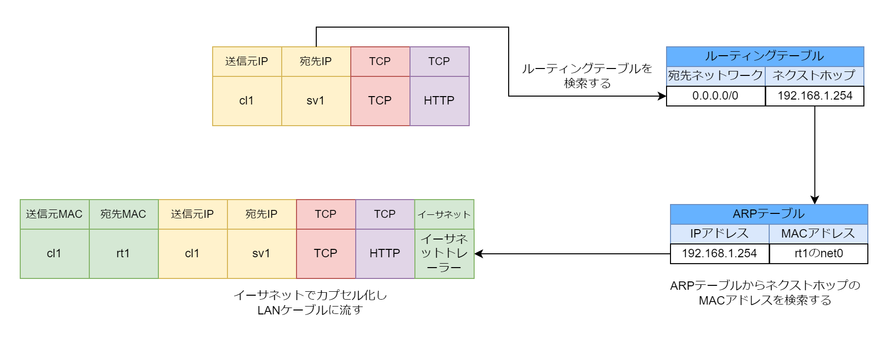

# ルーティング

## ルーティングとは

PC やルーターは IP パケットの宛先 IP アドレスと照らし合わせる「宛先ネットワーク」と IP パケットを転送すべき機器の IP アドレスを表す「ネクストホップ」という 2 つの情報を管理することでパケットの転送先を切り替えている。この IP パケットの転送先を切り替える機能を「ルーティング」と呼ぶ。実際にネクストホップにパケットを送信する場合は MAC アドレスとイーサネットを用いる。

## ルーティングテーブル

宛先ネットワークとネクストホップを管理するテーブルをルーティングテーブルと呼ぶ

## 実際のルーティングの流れ

1. cl1(192.168.1.1)が sv1(8.0.0.6:80)に対して HTTP リクエストをする。IP+TCP+HTTP パケットを作成する。192.168.1.1 をルーティングテーブルで検索するとデフォルトルートにマッチするのでネクストホップは rt1(192.168.1.254)になる。rt1 の MAC アドレスを ARP テーブルから検索する。レコードが存在しない場合は ARP Request を LAN セグメントにブロードキャストし、192.168.1.254 の MAC アドレスを検索する。送信元 MAC アドレスに cl1 の MAC アドレス、宛先 MAC アドレスを rt1 の MAC アドレスをセットして IP+TCP+HTTP パケットをイーサネットでカプセル化して LAN ケーブルに流す。
2. rt1 のルーティングテーブルを検索するとデフォルトルートにマッチするのでネクストホップは rt2(8.0.0.2 になる)。ルーティング後に IP MASQUERADE をして送信元 IP を 8.0.0.1 に送信元ポート番号も変更する。ARP プロトコルで rt2(8.0.0.2) の MAC アドレスを取得する。IP パケットをイーサネットでカプセル化して LAN ケーブルにパケットを流す。
3. rt2 のルーティングテーブルを検索すると 8.0.0.6/32 にマッチするのでネクストホップは rt3(8.0.0.4) になる。ARP プロトコルで rt3(8.0.0.4) の MAC アドレスを取得する。IP パケットをイーサネットでカプセル化して LAN ケーブルにパケットを流す。
4. rt3 のルーティングテーブルを検索すると 8.0.0.6/32 にマッチするので 8.0.0.6 は同一 LAN セグメントに存在していることがわかる。ARP プロトコルで 8.0.0.6 の MAC アドレスを取得する。IP パケットをイーサネットでカプセル化して LAN ケーブルにパケットを流す。
5. ルーティング前に DNAT して宛先 IP アドレス 8.0.0.6 を 172.16.0.1 に変更する。rt4 のルーティングテーブルを検索すると 172.16.0.0/24 にマッチするので 172.16.0.1 は同一 LAN セグメントに存在していることがわかる。ARP プロトコルで 172.16.0.1 の MAC アドレスを取得する。IP パケットをイーサネットでカプセル化して LAN ケーブルにパケットを流す。
6. sv1 はパケットを受け取ると宛先 MAC アドレス、宛先 IP アドレスが一致するので 80 番ポートのプロセスに HTTP パケットを渡す。

※宛先 IP アドレスと宛先 MAC アドレスは基本的に異なる

## ルーティングテーブルの作り方

- 静的ルーティング
  - 宛先ネットワークとネクストホップを手動で設定する
  - 家庭用ルーターやサーバーサイトルーターは性的ルーティングを採用している
- 動的ルーティング
  - 隣接するルーター同士でルート情報を交換して自動的にルートエントリーを作成する
  - 各プロバイダーが用意しているルーターは動的ルーティングを採用している
  - rt2 の 8.0.0.6/32 や rt4 の 8.0.0.1/32 のように直接接続していないネットワークは動的ルーティングでエントリーを作成する

## 典型的なルーティングテーブル

- PC・サーバー： LAN ケーブルで直接接続されている場合のネクストホップはローカルにする。それ以外の場合はネクストホップをルーターやファイアーウォールにする
- 家庭用ルーター・サーバーサイトルーター・ファイアーウォール： LAN ケーブルで直接接続されている場合のネクストホップはローカルにする。それ以外の場合はネクストホップを契約しているプロバイダーのルーターにする
- プロバイダーのルーター： LAN ケーブルで直接接続されている場合のネクストホップはローカルにする。非常に多くのネットワークのエントリーを持つ
