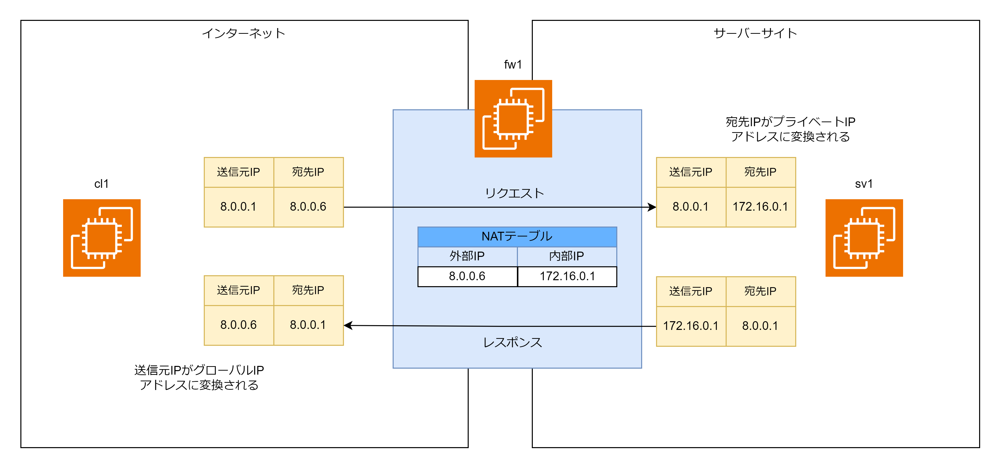
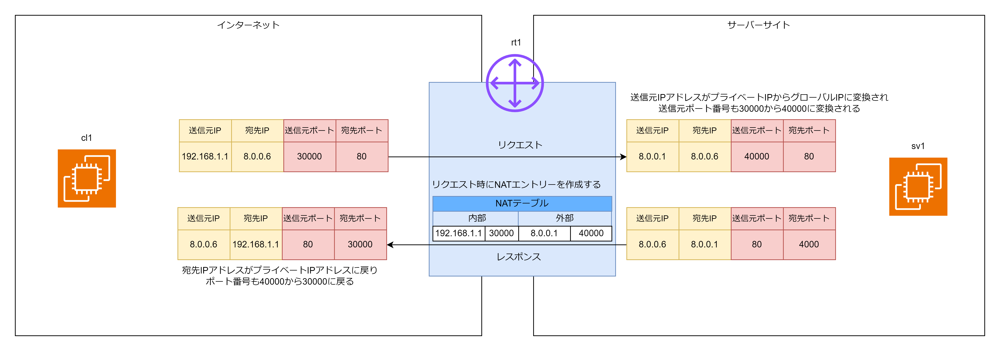

# NAT

## NAT とは

NAT は IP パケットの送信元 IP アドレス・宛先 IP アドレスを変換する技術。IP アドレスだけでなく送信元ポート番号・宛先ポート番号も変換できる。NAT は変換前後の IP アドレスやポート番号を NAT テーブルというテーブルで管理する。NAT テーブルがあるため、HTTP リクエストの送信元 IP アドレスを変換しても HTTP レスポンスの宛先 IP アドレスが NAT テーブルによって変換前の IP アドレスに戻すことができる。

## 静的 NAT

静的 NAT は外部と内部の IP アドレスを 1:1 に結び付けて変換する。静的 NAT はあらかじめ NAT テーブルに外部の IP アドレスと内部の IP アドレスを一意に紐づける NAT エントリーを持つ。  
主にサーバーサイトで使用される。  
サーバーサイトはファイアーウォールにグローバル IP アドレスを持ち、各サーバーはプライベート IP アドレスを持つ。ファイアーウォールで NAT によりグローバル IP アドレスを各サーバーのプライベート IP アドレスに変換する。サーバーへのリクエスト時には宛先 IP アドレスをプライベート IP アドレスに変換し、レスポンス時には送信元 IP アドレスをプライベート IP アドレスからグローバル IP アドレスに変換する。

```bash
iptables -t nat -A PREROUTING -d 8.0.0.6 -j DNAT --to 172.16.0.1
```



## NAPT (IP MASQUERADE)

NAPT は内部と外部の IP アドレスを n:1 に紐づける。NAPT は内部の IP アドレス+ポート番号と外部の IP アドレス+ポート番号を一意に紐づける NAT エントリーを NAT テーブルに動的に追加・削除する。  
主に家庭用のルーターで使用される。各 PC にはプライベート IP アドレスを割り当て外部と通信するときのみ送信元 IP アドレスをグローバル IP アドレスに変換するために使用される。  
PC から外部サーバーにアクセスする場合に家庭用ルーターで送信元 IP をグローバル IP アドレスに変換する。ポート番号も変換する。外部サーバーから PC へのレスポンスは宛先 IP アドレスと宛先ポート番号を NAT テーブルから検索し変換前の IP アドレスとポート番号に変換する。

```bash
iptables -t nat -A POSTROUTING -s 192.168.1.0/24 -j MASQUERADE
```



## NAT の使用例

- 家庭内 LAN からインターネットに通信する際に各 PC のプライベート IP アドレスをグローバル IP アドレスに変換するために使用する（NAPT・IP MASQUERADE）
- サーバーサイトのルーターがグローバル IP アドレスで通信を受け付けて、サーバーサイト LAN 内のプライベート IP アドレスに変換するために使用する（静的 NAT）
