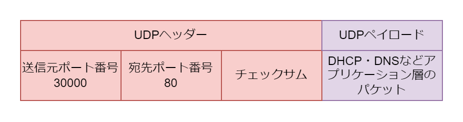

# UDP

## UDP の役割

- ポート番号を使用することで通信相手の端末の特定のアプリケーション（プロセス）にパケットを届ける
- チェックサムを使用してデータが壊れていないかチェックする
- TCP と違い即時性を求めるため、データの確認応答・接続交渉の処理は存在しない

## UDP のフォーマット

UDP パケットは UDP ヘッダーと UDP ペイロードで構成される。UDP ヘッダーは送信元ポート番号・宛先ポート番号をもつ。UDP ペイロードにはアプリケーション層のパケットが入る。

