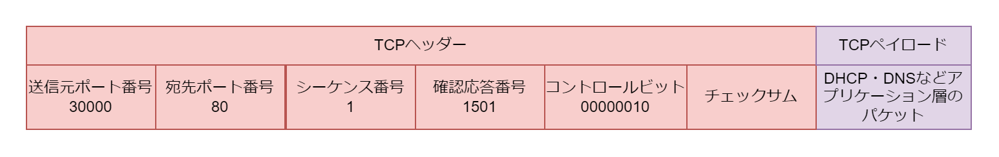
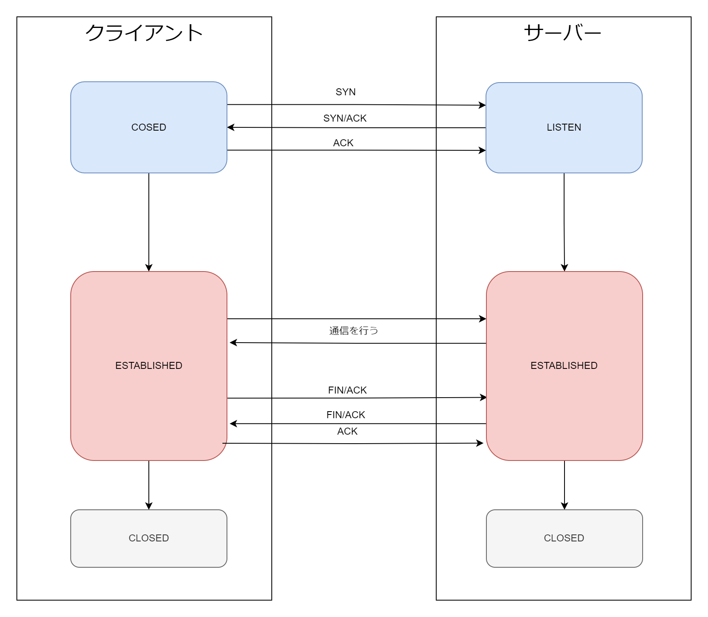

# TCP

## TCP の役割

- ポート番号を使用することで通信相手の端末の特定のアプリケーション（プロセス）にパケットを届ける
- チェックサムを使用してデータが壊れていないかチェックする
- UDP と違い信頼性を求めるため、データの確認応答・接続交渉の処理が存在する

## TCP のフォーマット

TCP データグラムは TCP ヘッダーと TCP ペイロードで構成される。TCP ペイロードにはアプリケーション層のパケットが入る。

- シーケンス番号  
  シーケンス番号は TCP パケットを正しい順番で並べるための 4 バイトのフィールド
- 確認応答番号(ACK 番号)  
  次はこのシーケンス番号のデータをくださいと通信相手に伝えるための 4 バイトのフィールド
- コントロールビット  
  コネクションの状態を制御する 8 ビットのフィールド
  |ビット|フラグ名|説明|
  |:--|:--|:--|
  |1 ビット目|CWR|Congestion Window Reduced|
  |2 ビット目|ECE|ECN-Echo|
  |3 ビット目|URG|Urgent Pointer field significant|
  |4 ビット目|ACK|Acknowledgement field significant|
  |5 ビット目|PSH|Push Function|
  |6 ビット目|RST|Reset the connection|
  |7 ビット目|SYN|Synchronize sequence numbers|
  |8 ビット目|FIN|No more data from sender|

## TCP の接続処理

1. 3 ウェイハンドシェイクによって接続を開始する
2. シーケンス番号や確認応答番号を利用してパケットのやり取りをする
3. 3 ウェイハンドシェイクまたは 4 ウェイハンドシェイクによって接続を終了する

