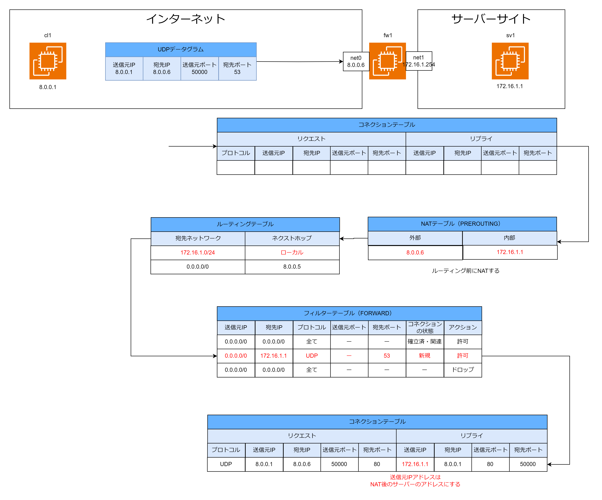
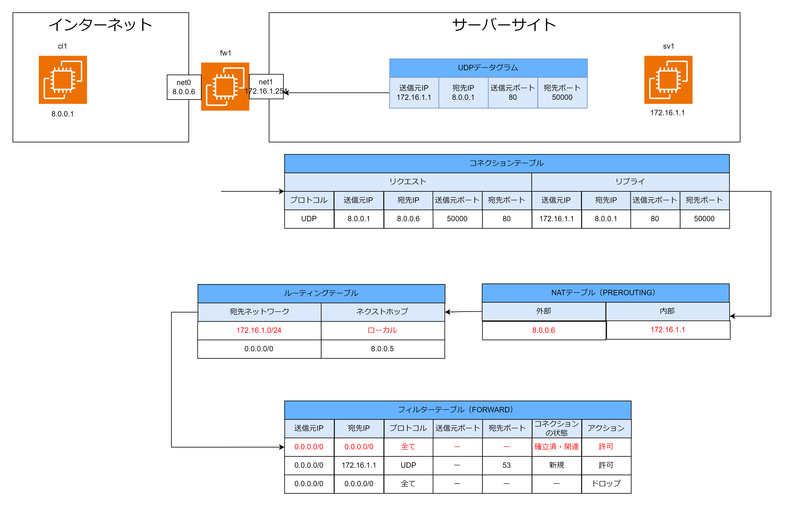

# UDP ファイアーウォール

## ファイアーウォールとは

送信元/宛先 IP アドレス、レイヤー 4 プロトコル、送信元/宛先ポート番号で通信の許可・拒否を行いシステムを脅威から守る。

## UDP ファイアーウォールの実現方法

通信の許可・拒否を定義する「ファイアーウォールルール」で構成された「フィルターテーブル」と、通信の状態を動的に管理する「コネクションテーブル」を用いて実現する。コネクションテーブルを用いることでステートフルなファイアーウォールを構成できる。フィルターテーブルは iptables、コネクションテーブルは conntrack で管理する。

## ステートフルとは

ステートフルとは cl1:30000 から sv1:80 への通信が行われたことを記憶することである。コネクションテーブルに動的に通信状態をレコードとして追加することで実現する。コネクションテーブルに通信状態を記憶することで sv1:80 から cl1:30000 へのレスポンス時にコネクションテーブルを参照してレコードが存在していればフィルターテーブルで通信が許可されていなくても自動的に通信を許可することができる。

## ファイアーウォールの流れ

サーバーサイトへのリクエスト時の流れ

1. コネクションテーブルに対応するエントリーがないか確認。初めてサーバーサイトに接続する場合はエントリーが存在しない。
2. ルーティング前に NAT テーブルを見て宛先 IP アドレスをグローバル IP アドレス(8.0.0.6)からプライベート IP アドレス(172.16.1.1)に変換する
3. ルーティングテーブルを見てネクストホップを決定する。今回の場合はネクストホップはローカルで同一ネットワーク上に宛先 IP アドレスが存在しているため 172.16.1.1 の MAC アドレスを取得する
4. フィルターテーブルを見て接続が許可されているか確認する。今回の場合は-p udp -d 172.16.1.1 --dport 53 --ctstate NEW -j ACCEPT に一致するため通信を許可する。
5. 通信が許可されたのでコネクションテーブルにレコードを追加する。リプライの送信元 IP は NAT で変換後のプライベート IP アドレス(172.16.1.1)にする。

クライアントへのレスポンスの流れ

1. コネクションテーブルに対応するエントリーがないか確認する。対応するコネクションエントリーが存在する。
2. ルーティング前に NAT テーブルを見て送信元 IP アドレスをプライベート IP アドレス(172.16.1.1)からグローバル IP アドレス(8.0.0.6)に変換する
3. ルーティングテーブルを見てネクストホップを決定する。宛先ネットワークがデフォルトルートのレコードが対応しているのでネクストホップは 8.0.0.5 になる。
4. フィルターテーブルを見て接続が許可されているか確認する。コネクションテーブルにエントリーが存在し、フィルターテーブルで確立済みの通信が許可されているため通信を許可する。

