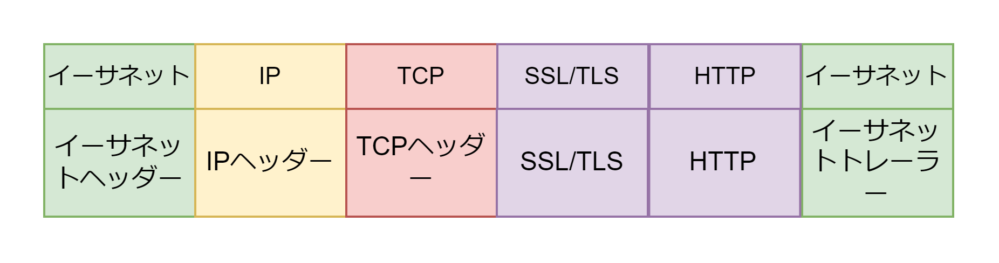
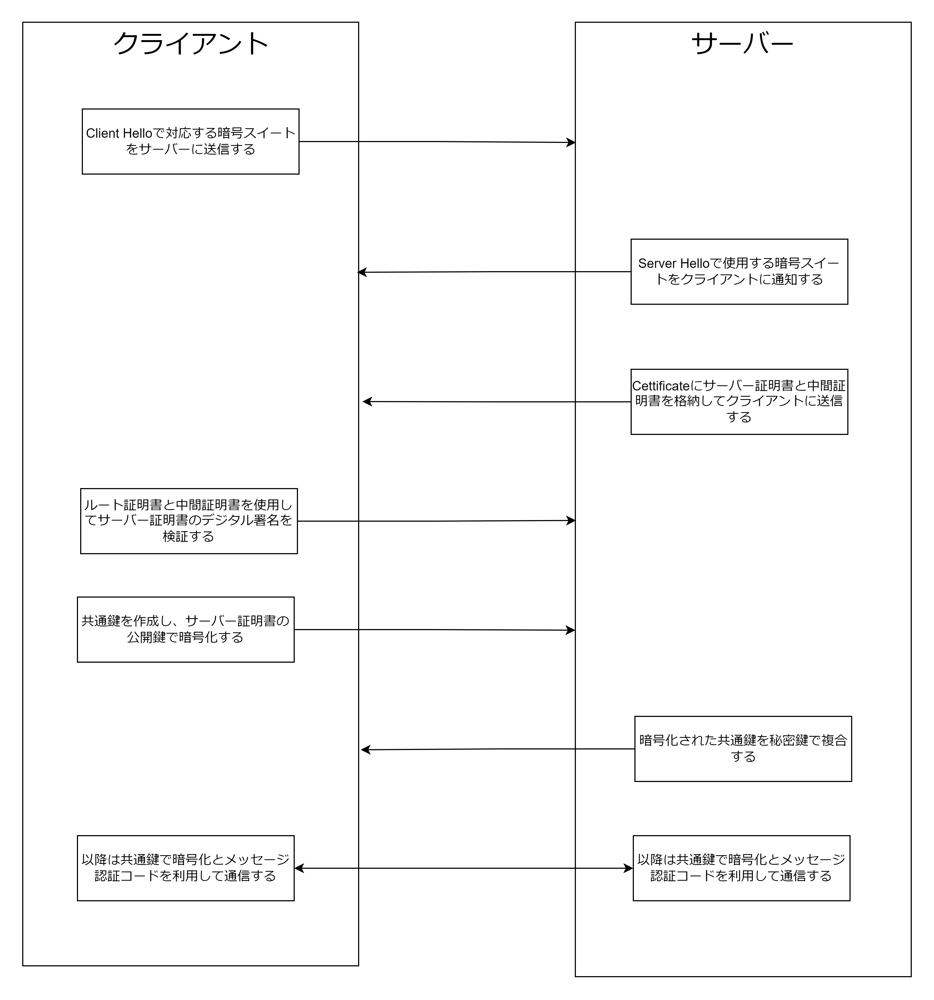

# SSL/TLS

## SSL/TLS とは

SSL/TLS は TCP と HTTP の間で働くプロトコル。  
SSL/TLS の役割は以下の 3 つ。

- 正しいサーバーであるかを検証する（サーバー証明書）
- HTTP パケットを暗号化する（共通鍵暗号）
- HTTP パケットの改ざんを検知する（MAC メッセージ認証コード）

## SSL/TLS のフォーマット



## SSL/TLS の通信の流れ



## サーバーを SSL/TLS 化する

1. RSA 公開鍵と RSA 秘密鍵を作成する
2. RSA 公開鍵とドメイン名を指定して CSR(Certificate Signing Request)を作成する
3. 認証局に認証局が持つ秘密鍵で CSR にデジタル署名を付与してサーバー証明書を作成してもらう。
4. サーバー証明書と中間証明書と RSA 秘密鍵を Web サーバーにインストールする

## サーバー証明書

サーバー証明書は公開鍵とドメイン名とデジタル署名を持つ。認証局に認証局が持つ秘密鍵で公開鍵とドメイン名を合わせた CSR に署名してデジタル署名を作成してもらう。ブラウザはサーバーからサーバー証明書とサーバー証明書にデジタル署名した認証局の中間証明書を受信する。ブラウザはブラウザもしくは OS 自身が持つルート証明書の公開鍵を使用して中間証明書のデジタル署名を検証し、中間証明書に含まれる公開鍵を使用してサーバー証明書のデジタル署名を検証する。  
認証局を自分にした自分を自分でデジタル署名をする自己署名証明書も存在する。自己署名証明書は以下のように作成する。

```bash
# ドメインをwww.example.comとし、RSA2048の公開鍵と秘密鍵を作成し、sha256でデジタル署名し、有効期限を36500日にし、サーバー証明書のタイプをx509にし、秘密鍵のファイル名をkeyoutで指定し、サーバー証明書のファイル名をoutで指定する
openssl req -subj '/CN=www.example.com/C=JP' -new -newkey rsa:2048 -sha256 -days 36500 -nodes -x509 -keyout /etc/ssl/private/server.key -out /etc/ssl/private/server.crt
```
