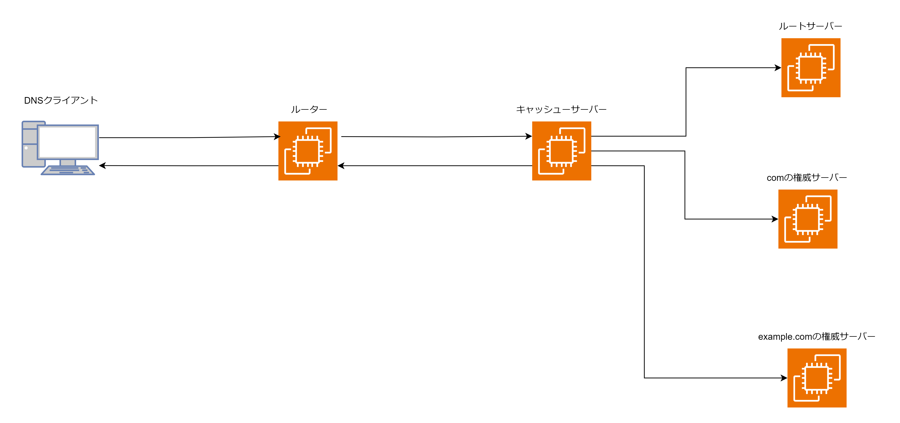

# DNS

## DNS とは

ドメイン名と IP アドレスを相互に変換するためのプロトコル。

## 名前解決

ドメイン名と IP アドレスを相互に変換する処理を名前解決と呼ぶ。名前解決には「hosts ファイル」または DNS のどちらかを使用する。LinuxPC の場合は、/etc/nsswitch.conf の hosts 行によって hosts ファイルと DNS の優先度が変わる。

```/etc/nsswitch.conf
hosts:        files dns

passwd:       files
group:        files
shadow:       files
gshadow:      files
```

上記 nsswitch.conf ファイルの場合はまず hosts ファイルで名前解決を試み、名前解決できなかった場合は DNS を使用する。

```/etc/hosts
127.0.0.1   localhost
::1   localhost ip6-localhost

172.16.1.1 sv1.example.com
```

/etc/resolv.conf にキャッシュサーバーの IP アドレスが格納されている。このキャッシュサーバーに再帰クエリを送信する。

```/etc/resolv.conf
nameserver 8.8.8.8
search example.com
```

search 以下にドメイン名を記載すると、ホスト名のみでも名前解決ができる。例えばブラウザに https://www と記載するだけでwww.example.comのIPアドレスを解決してくれる。

## DNS による名前解決

DNS による名前解決は「DNS クライアント」「キャッシュサーバー」「権威サーバー」が相互に連携しあうことで成立する。

- DNS クライアント  
  DNS クライアントは DNS サーバーに名前解決を要求するクライアント端末・ソフトウェアのこと。Web ブラウザや dig コマンドなどが DNS クライアントにあたる。DNS クライアントはキャッシュサーバーに再帰クエリを送信し、キャッシュサーバーから受け取った結果を一定時間キャッシュする。
- キャッシュサーバー  
  キャッシュサーバーは DNS クライアントからの再帰クエリを受け付け、権威サーバーに反復クエリを送信する。キャッシュサーバーも権威サーバーから受け取った結果をキャッシュする。  
  Linux では UNBOUND が良く利用される。
- 権威サーバー  
  権威サーバーは自分が管理するドメインの範囲（ゾーン）に関してキャッシュサーバーからの反復クエリを受け付ける DNS サーバー。自分が管理するドメインの範囲（ゾーン）に関する各種情報（ドメイン名や IP アドレス）を「ゾーンファイル」というデータベースに「リソースレコード」という形で保持している。  
  インターネットの権威サーバーはは「ルートサーバー」を頂点としたツリー上の階層構造になっている。  
  Linux では BIND が良く利用される。

## 名前解決の流れ



1. ブラウザにhttps://www.example.comと打ち込む。nsswitch.confファイルを見でhostsファイルによる名前解決またはDNSによる名前解決を行う。/etc/hostsファイルにwww.example.comが存在しないのでDNSによる名前解決を試みる。/etc/resolve.confにキャッシュサーバーのIPアドレスが格納されているのでキャッシュサーバーに再帰クエリを送信する。

2. ルーターは「DNS フォワーダー（DNS プロキシ）」という機能を持つ。この機能を利用して再帰クエリをキャッシュサーバーに転送する。

3. キャッシュサーバーは再帰クエリを受け取るとルートサーバーから順に反復クエリを行う。ルーターサーバーの IP アドレスは/usr/share/dns/root.hints ファイルに定義されている。ルートサーバーから com の権威サーバーの NS レコードと A レコードを受け取り、com の権威サーバーにクエリを送信する。com の権威サーバーから example.com の権威サーバーの NS レコードと A レコードを受け取り、example.com の権威サーバーにクエリを送信する。example.com からwww.example.comのAレコードを受け取る。キャッシュサーバーにクエリ結果を送信する。

```/usr/share/dns/root.hints
.                       3600000   NS    .A.ROOT=SERVERS.NET.
A.ROOT-SERVERS.NET.     3600000   A     3.3.3.3
A.ROOT-SERVERS.NET.     3600000   AAAA  2001:503:ba3e::2:30
```

4. キャッシュサーバーは結果を受信しキャッシュする。ルーターに結果を送信する。

5. DNS クライアントは結果を受信しキャッシュする。

## ゾーンファイルとゾーンレコード

ゾーンファイルは自分が管理するドメインに関する情報をゾーンファイルで管理する。ゾーンファイルには複数のリソースレコードが存在する。  
リソースレコードは「ドメイン名」「TTL」「タイプ」「データ」から構成される。

```bash
example.com       IN    NS    dns.example.com # example.comの権威サーバーのDNS名はdns.example.com
example.com       IN    A     4.5.4.5
dns.example.com   IN    A     4.5.4.5
www.example.com   IN    A     2.3.4.3
example.com       IN    MX    mail.example.com # @example.com宛てのメールはmail.example.comサーバーに送信する
mail.example.com  IN    A     2.3.2.2
```

| リソースレコード | 内容                                                   |
| :--------------- | :----------------------------------------------------- |
| SOA レコード     | ゾーンの管理的な情報が記述されたタイプ                 |
| A レコード       |                                                        |
| AAAA レコード    |                                                        |
| NS レコード      | 権威サーバーの IP アドレス                             |
| MX レコード      | メールサーバー                                         |
| PTR レコード     | IP アドレスからドメイン名を検索する逆引き              |
| CNAME レコード   | ホストの別名。ドメイン所持を確認するためにも使用される |
| TXT レコード     | コメントが記述されたレコード。SPF・DKIM にも利用される |
