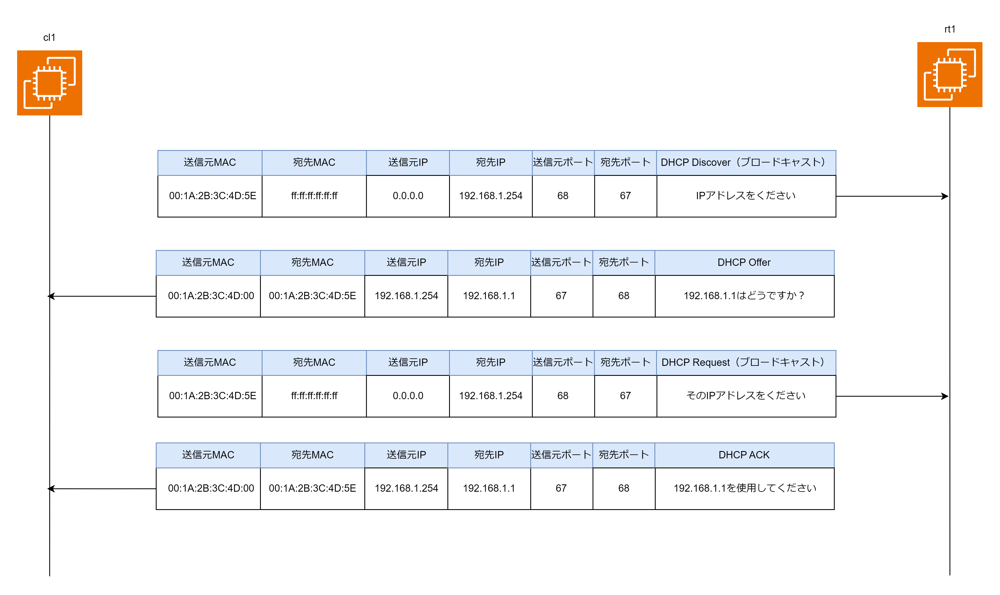

# DHCP(Dynamic Host Control Protocol)

## DHCP とは

DHCP は IP アドレスやそのサブネットマスク、デフォルトゲートウェイ、DNS キャッシュサーバーの IP アドレスなどネットワークに接続するための設定を配布するプロトコル。家庭内 LAN で Wifi に接続したり LAN ケーブルを挿すだけでインターネットに接続できるのは DHCP が勝手に IP アドレスなどを設定してくれるから。

## DHCP のフォーマット

DHCP は UDP/67 でカプセル化した UDP ペイロード部分に設定情報が詰め込まれる。DHCP で重要なフィールドは「割り当てクライアント IP アドレス」「クライアント MAC アドレス」「オプション」の 3 つ。

- 割り当てクライアント IP アドレス  
  実際に DHCP サーバーから端末に配布され、ネットワークインターフェースに設定される IP アドレスが格納される

- クライアント MAC アドレス  
  端末の MAC アドレスが格納される

- オプション  
  オプションにはメッセージのタイプ（Discover/Offer/Request/Ack）やサブネットマスク、デフォルトゲートウェイ、DNS キャッシュサーバーの IP アドレスなどネットワーク設定に関する情報が格納される。

|オプションコード|意味|Wireshark での表記|
|1|サブネットマスク|Subnet Mask|
|2|デフォルトゲートウェイ|Router|
|6|DNS キャッシュサーバーの IP アドレス|Domain Name Server|
|12|ホスト名|Host|
|42|NTP サーバーの IP アドレス|Network Time Protocol Servers|
|51|IP アドレスのリース時間|IP address Lease Time|
|53|DHCP メッセージのタイプ|DHCP Message Type|

## DHCP の流れ

DHCP は「IP アドレスをください」とブロードキャストで聞いて、DHCP サーバーが「この IP アドレスを使用してください」と返信するイメージ。

1. DHCP クライアントは IP アドレスを取得するために、「DHCP Discover」をブロードキャストする。
2. DHCP Discover を受け取った DHCP サーバーは、DHCP プールから IP アドレスを選択して「DHCP Offer」を DHCP クライアントに送信する。
3. DHCP Offer を受け取った DHCP クライアントは「DHCP Request」をブロードキャストで送信し、「その IP アドレスでお願いします」と伝える。
4. DHCP Request を受け取った DHCP サーバーは「DHCP ACK」を DHCP クライアントに送信する。
5. DHCP ACK を受け取った DHCP クライアントは DHCP Offer で渡された IP アドレスをネットワークインターフェースカードに設定する。デフォルトゲートウェイや DNS キャッシュサーバーの IP アドレスも設定する。受け取った IP アドレスにはリース時間が設定されているのでリース時間が経過すると「DHCP Release」を送信して IP アドレスを開放して、DHCP サーバーに IP アドレスを返却する

