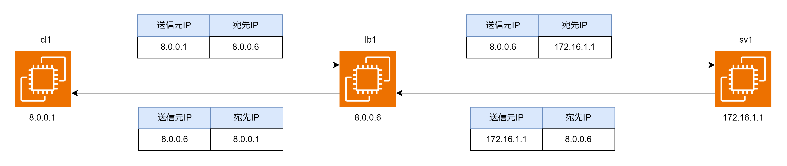

# サーバー負荷分散

## サーバー負荷分散とは

サーバー負荷分散はクライアントから受けっと多パケットを複数のサーバーに振り分ける技術のこと。サーバー負荷分散は主に 3 つの機能が組み合わさってできている。

- 負荷分散方式（負荷分散アルゴリズム）  
  負荷分散アルゴリズムを用いてどのサーバーにパケットを割り振るかを決定する。よく使用されるアルゴリズムは「ラウンドロビン」と「最小接続数」の 2 つ。ラウンドロビンはサーバーに順番に割り振りを行う。最小接続数はサーバーの TCP コネクションの数を監視し、よりコネクションが少ないサーバーに割り振りを行う。

- ヘルスチェック
  ヘルスチェックは負荷分散対象のサーバーの状態を監視する機能。ヘルスチェック方法としては「HTTP チェック」「TCP チェック」「Exec チェック」がある。TCP チェックは SYN パケットを定期的に投げ、SYN/ACK パケットの戻りを見ることで TCP サービスの状態を監視する。HTTP チェックは HTTP リクエストを定期的に投げ、HTTP レスポンスの内容を見ることで HTTP アプリケーションの状態を監視する。Exec チェックはサーバーで指定されたコマンドを実行し、終了コードを見ることでサーバーの状態を監視する。

- パーシステンス
  パーシステンスはアプリケーションにおける同一セッションを同じサーバーに割り振り続ける機能。パーシステンスの方式は主に「送信元 IP アドレスパーシステンス」と「Cookie パーシステンス」の 2 つがある。  
  送信元 IP アドレスパーシステンスは送信元の IP アドレスを見て一定時間同じサーバーに割り振るパーシステンス。  
  Cookie パーシステンスは Cookie の情報を見て一定時間同じサーバーに割り振り続けるパーシステンス。SERVER Web#1 のような Cookie を設定することで Web#1 のサーバーに割り振り続けることができる。

## 負荷分散の流れ

- 負荷分散装置からサーバーに送信する  
  IP パケットの送信元 IP アドレスを負荷分散装置の IP アドレスに変換する。送信元 IP アドレスを負荷分散装置の IP アドレスに変換するのはサーバーからのレスポンスを負荷分散装置が受け取り、負荷分散装置からクライアント端末にレスポンスを返却するため。  
  宛先 IP アドレスを負荷分散装置の IP アドレスからサーバーの IP アドレスに変換する。

- 負荷分散装置からレスポンスをクライアント端末に送信する  
  宛先 IP アドレスを負荷分散装置の IP アドレスからクライアント端末の IP アドレスに変換する。  
  送信元 IP アドレスをサーバーの IP アドレスから負荷分散装置の IP アドレスに変換する。

## 負荷分散装置の設定

1. リスナーの設定  
   リクエストを受け付ける IP アドレス・ポート番号を設定する  
   例）8.0.0.6:80

2. ターゲットの設定  
   負荷分散対象のサーバー群の設定をする。負荷分散対象サーバーの IP アドレス・ポート番号・負荷分散アルゴリズム・パーシステンス・ヘルスチェック・X-Forwarded-For・X-Forwarded-For-Proto の設定をする。
