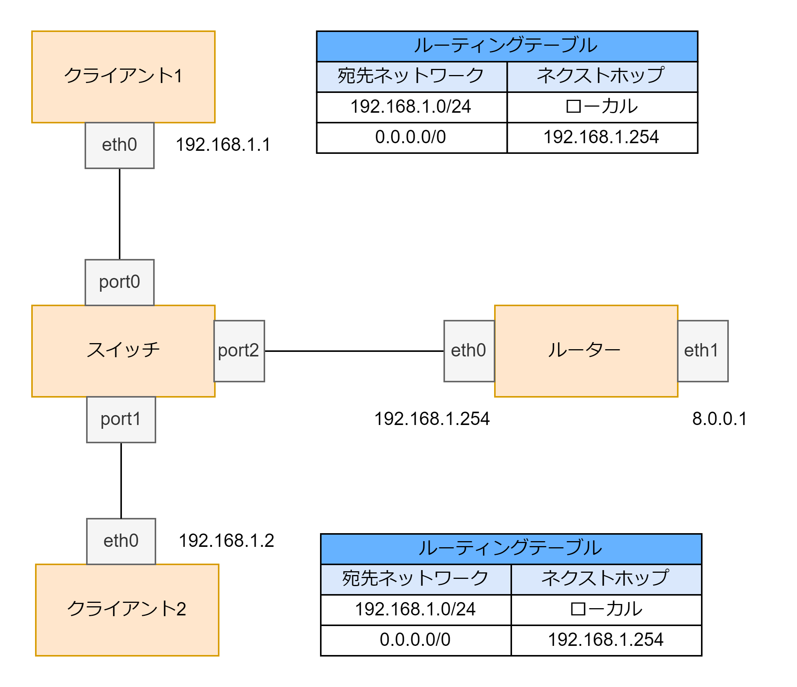
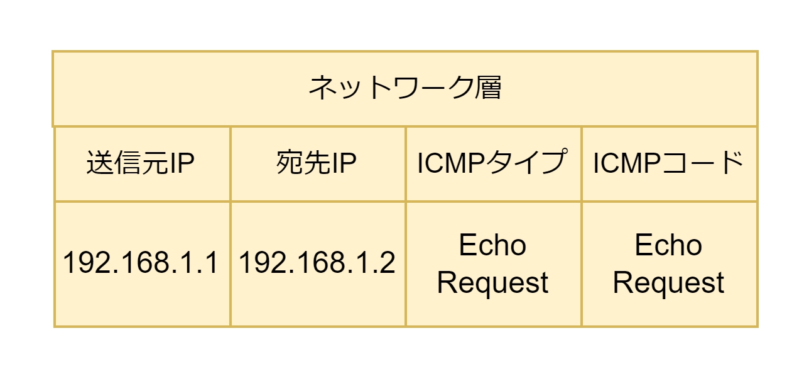
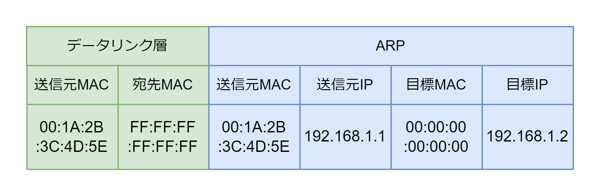
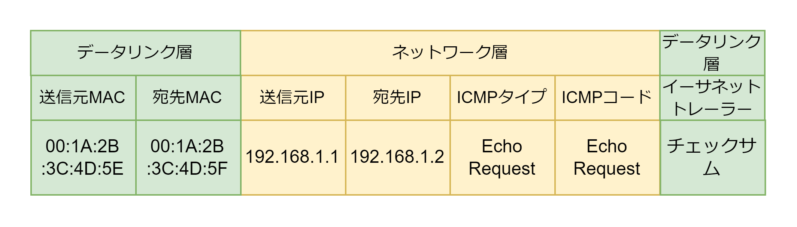

# パケットのすべての流れ

## 同じ LAN 内の端末に ping する場合

ping は ICMP Echo リクエストを送信するコマンド。ICMP は物理層・データリンク層・ネットワーク層のプロトコルしか使用しない。

クライアント 1 からクライアント 2 に ping コマンドを送信する場合のパケットの流れは以下のようになる。

1. クライアント 1 はネットワーク層のパケットを以下のように作成する。
   

2. ルートテーブルを見てネクストホップを取得する。宛先ネットワーク 192.168.1.0/24 にマッチするのでネクストホップはローカルで同一 LAN 内に 192.168.1.2 が存在するとわかる。

3. 192.168.1.2 が同一 LAN 内に存在するので ARP テーブルから 192.168.1.2 の MAC アドレスを取得する。ARP テーブルにエントリーが存在しない場合は、目標 IP アドレス 192.168.1.2 で ARP Request パケットを LAN 内にブロードキャストする
   

4. ARP Reply を受信し、192.168.1.1 の MAC アドレス 00:1A:2B:3C:4D:5E を取得する。ARP テーブルにエントリーを追加する。

5. イーサネットパケットを作成し IP パケットをカプセル化して LAN ケーブルにパケットを流す。
   

6. スイッチはイーサネットパケットの宛先 MAC アドレスと MAC アドレステーブルを照らし合わせてパケットを転送するポート番号を取得する。MAC アドレステーブルに MAC アドレスが存在しない場合はクライアント 1 以外の端末すべてに転送する。

7. クライアント 2 はパケットを受け取る。

## HTTPS でサーバーに接続する場合

cl1 から lb1（ロードバランサーに）HTTPS 接続する。

### 1. NCI 設定フェーズ（DHCP）

1. 家庭内 LAN 内の cl1 はネットワークに接続すると DHCP Discover をブロードキャストする。
2. ブロードバンドルータ rt1 が DHCP プールから 192.168.1.1 を選び DHCP Offer を cl1 に送信する。
3. cl1 は DHCP Request をブロードキャストする。
4. rt1 は DHCP ACK を cl1 に送信する。
5. cl1 はネットワークインターフェースに 192.168.1.1/24 を設定する。デフォルトゲートウェイ(192.168.1.254)や DNS キャッシュサーバの IP アドレス(192.168.1.254)を設定する。

### 2. 名前解決フェーズ（DNS）

1. cl1 はブラウザでhttps://www.example.comにアクセスする。
2. cl1 は DNS キャッシュサーバーとして登録されている rt1 に再帰クエリを送信する
3. rt1 は DNS フォワーダーとなって、DNS キャッシュサーバーである ns1 に再帰クエリを転送する。
4. ns1 はルート権威サーバー → com の権威サーバー → example.com の権威サーバーに反復問い合わせをしてwww.example.comのAレコードを取得しキャッシュする。rt1にAレコードを送信する。
5. rt1 は cl1 に A レコードを送信する。
6. cl1 はwww.example.comのIPアドレスを受信する。

### 3. 3 ウェイハンドシェイクフェーズ

1. cl1 はサーバーサイトのグローバル IP アドレス 10.1.3.12 に対して SYN パケットを送信する。
2. rt1 は送信元 IP アドレスをグローバル IP アドレスである 10.1.1.245 に NAPT して rt2 にルーティングする。NAT テーブルに変換前の IP アドレスとポート番号、変換後の IP アドレスとポート番号を追加する。
3. fw1 は宛先 IP アドレスをグローバル IP アドレス 10.1.3.12 からプライベート IP アドレス 172.16.3.12 に変換する。SYN パケットをフィルターテーブルに基づいて許可する。
4. lb1 は cl1 と 3 ウェイハンドシェイクを行い TCP コネクションを確立する。

### 4. SSL ハンドシェイク

1. cl1 は TCP コネクションを確立した 10.1.3.12 に対して Client Hello を送信して SSL ハンドシェイクを開始する。
2. cl1 と lb1 で共通鍵を共有する。

### 5. SSL オフロード + 負荷分散フェーズ

1. SSL ハンドシェイクが終わると、cl1 は HTTP リクエストを共通鍵で暗号化して送信する。
2. lb1 は SSL で暗号化された HTTP リクエストを複合し、送信元 IP アドレスを 172.16.2.254、宛先 IP アドレスを負荷分散対象の sv1(172.16.2.1)か sv2(172.16.2.2)のどちらかに変換して負荷分散する。
3. HTTP リクエストを受け取ったサーバーは HTTP リクエストを処理し、レスポンスを lb1 に返却する。
4. lb1 は HTTP レスポンスを共通鍵で暗号化し cl1 に返却する。
5. cl1 は受けとった HTTP レスポンスを共通鍵で複合する。
6. cl1 は HTTP レスポンスを受け取ると、close_notify で SSL セッションをクローズした後、RST パケットで TCP コネクションをクローズする。
