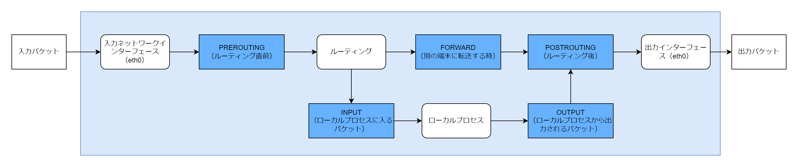

# コマンド一覧

## tcpdump

パケットをキャプチャーするためのコマンド。tcpdump 実行後に流れるパケットをキャプチャーする。

```bash
tcpdump -i net0 -w /tmp/tinet/ip.pcapng port 80
```

| プロトコル   | オプション                             | 意味                                                                                                                     |
| :----------- | :------------------------------------- | :----------------------------------------------------------------------------------------------------------------------- |
| 全般         | -c <パケット数>                        | 指定した数のパケットをキャプチャーする                                                                                   |
|              | -i <インターフェース名>                | 指定したインターフェースのパケットをキャプチャーする。any を指定すると全てのインターフェースのパケットをキャプチャーする |
|              | -v -vv -vvv                            | 詳細な情報を表示する。v を増やすほどより詳細になる                                                                       |
|              | -w <ファイル名>                        | キャプチャーしたパケットを指定したファイルに書き出す                                                                     |
| イーサネット | ether host <MAC アドレス>              | MAC アドレスを指定したイーサネットフレーム                                                                               |
|              | ether src <MAC アドレス>               | 送信元 MAC アドレスが MAC アドレスを指定したイーサネットフレーム                                                         |
|              | ether dst <MAC アドレス>               | 宛先 MAC アドレスが MAC アドレスを指定したイーサネットフレーム                                                           |
|              | ether proto <プロトコル名>             | ip や arp など                                                                                                           |
|              | ether broadcast                        | ブロードキャストのイーサネットフレーム                                                                                   |
| ARP          | arp                                    | 全ての ARP フレーム                                                                                                      |
|              | not arp                                | ARP 以外のフレーム                                                                                                       |
|              | arp[6:2]                               | ARP Request                                                                                                              |
|              | arp[6:2]                               | ARP Response                                                                                                             |
| IP           | host <IP アドレス>                     | 宛先 IP または送信元 IP が指定した IP アドレスのパケット                                                                 |
|              | src host <IP アドレス>                 |                                                                                                                          |
|              | dst host <IP アドレス>                 |                                                                                                                          |
|              | net <IP アドレス/サブネットマスク>     |                                                                                                                          |
|              | net src <IP アドレス/サブネットマスク> |                                                                                                                          |
|              | net dst <IP アドレス/サブネットマスク> |                                                                                                                          |
|              | ip proto <プロトコル名>                |                                                                                                                          |
|              | ip broadcast                           |                                                                                                                          |
| ICMP         | icmp[0] == <タイプ>                    |                                                                                                                          |
|              | icmp[1] == <コード>                    |                                                                                                                          |
| UDP          | udp                                    | 全ての UDP データグラム                                                                                                  |
|              | udp port <ポート番号>                  | 送信元ポート番号または宛先ポート番号が指定したポート番号の UDP データグラム                                              |
|              | udp src port <ポート番号>              |                                                                                                                          |
|              | udp dst port <ポート番号>              |                                                                                                                          |
| TCP          | tcp                                    | 全ての TCP パケット                                                                                                      |
|              | tcp port <ポート番号>                  | 送信元ポート番号または宛先ポート番号が指定したポートの TCP パケット                                                      |
|              | tcp src port <ポート番号>              |                                                                                                                          |
|              | tcp dst port <ポート番号               |                                                                                                                          |

## ifconfig

ネットワークインターフェースの設定や情報の表示をする

```bash
ifconfig net0
```

## ping

ICMP echo パケットを送信する

```bash
ping 192.168.1.1 -c 2
```

| オプション                           | 意味                                                      |
| :----------------------------------- | :-------------------------------------------------------- |
| -4                                   | ipv4                                                      |
| -6                                   | ipv6                                                      |
| -c <カウント>                        | パケットを送信する回数を設定する                          |
| -i <秒>                              | インターバルを設定する                                    |
| -I <インターフェース名\|IP アドレス> | パケットを送信するインターフェース・IP アドレスを指定する |
| -t \<TTL>                            | TTL を設定する                                            |

## ip

ネットワークインターフェース・MAC アドレス・IP アドレス・ARP テーブルの設定や情報取得を行う

```bash
ip link # ネットワークインターフェースのMACアドレスを表示する
ip -d link # より詳細なネットワークインターフェースの情報を表示する
ip link set net0 address 02:42:ff:6d:2b:ac # MACアドレスを設定する

ip neigh # ARPテーブルを表示する
ip neigh add <IPアドレス> dev <インターフェース名> lladdr <MACアドレス> # ARPエントリーを追加する
ip neigh del <IPアドレス> dev <インターフェース名> # ARPエントリーを削除するf
ip neigh flush all # 全てのARPエントリーを削除する
ip neigh flush dev <インターフェース名> # 指定したインターフェースのARPエントリーを削除する

ip addr # ネットワークインターフェースのIPアドレス・MACアドレスを表示する
ip -d addr # より詳細なネットワークインターフェースの情報を取得する（VLANタグなど）

ip route # ルーティングテーブルを表示する
ip route add 192.168.1.0/24 via 192.268.1.254 # ルーティングテーブルにエントリーを追加する
ip route del 192168.1.0/24 via 192.168.1.254 # ルーティングエントリーを削除する
```

## iptables

ファイアーウォール・NAT の設定ができる。

<table>
  <tr>
    <th>オプションカテゴリー</th>
    <th>オプション</th>
    <th>意味</th>
  </tr>
  <tr>
    <td>テーブルオプション</td>
    <td>-A <チェイン名></td>
    <td>指定したチェインに最後のエントリーを追加する</td>
  </tr>
  <tr>
    <td rowspan="6">コマンドオプション</td>
    <td>-A <チェイン名></td>
    <td>指定したチェインの最後にエントリーを追加する</td>
  </tr>
  <tr>
    <td>-D <チェイン名> <ルール番号></td>
    <td>指定したチェインのルール番号のエントリーを削除する</td>
  </tr>
  <tr>
    <td>-F <チェイン名></td>
    <td>指定したチェインの内容を削除する</td>
  </tr>
  <tr>
    <td>-I <チェイン名> <ルール番号> <ルール></td>
    <td>指定したチェインのルール番号にエントリーを追加する</td>
  </tr>
  <tr>
    <td>-P <チェイン名> <処理></td>
    <td>指定したチェインのデフォルトの処理を指定する</td>
  </tr>
  <tr>
    <td>-L <チェイン名></td>
    <td>指定したチェインのルールを表示する</td>
  </tr>
  <tr>
    <td rowspan="6">パラメータオプション</td>
    <td>-d <IPアドレス/[サブネットマスク]></td>
    <td>宛先IPアドレスを指定する</td>
  </tr>
  <tr>
    <td>-i <インターフェース名></td>
    <td>パケットを受信するインターフェース名を指定する</td>
  </tr>
  <tr>
    <td>-j <処理></td>
    <td>
      パケットがマッチした場合の処理を指定する<br>
      ACCEPT・DROP・REJECT・DNAT・SNAT・MASQUERADE
    </td>
  </tr>
  <tr>
    <td>-o <インターフェース名></td>
    <td>パケットを送信するインターフェース名を指定する</td>
  </tr>
  <tr>
    <td>-s <IPアドレス/[サブネットマスク]></td>
    <td>送信元IPアドレスを指定する</td>
  </tr>
  <tr>
    <td>-p <プロトコル名></td>
    <td>プロトコルを指定する</td>
  </tr>
  <tr>
    <td rowspan="4">マッチング拡張オプション</td>
    <td>-m conntrack</td>
    <td>
      コネクションテーブルのコネクションの状態を指定する<br>
      --ctstate <接続状態>を続けて入力することで以下のパラメータを指定可能<br>
      <li>ESTABLISHED</li>
      <li>RELATED</li>
      <li>NEW</li>
    </td>
  </tr>
  <tr>
    <td>-m tcp</td>
    <td>
      --sport・--dportを指定可能
    </td>
  </tr>
  <tr>
    <td>-m udp</td>
    <td>
      --sport・--dportを指定可能
    </td>
  </tr>
  <tr>
    <td>-m icmp</td>
    <td>
      --icmp-type <タイプ番号>を指定可能
    </td>
  </tr>
</table>

```bash
# 静的NAT
iptables -t nat -A PREROUTING -d 8.0.0.6 -j DNAT --to 172.16.0.1

# NAPT
iptables -t nat -A POSTROUTING -s 192.168.1.0/24 -j MASQUERADE

# ファイアーウォール
iptables -P FORWARD DROP
iptables -A FORWARD -p udp -d 172.16.1.1 -m udp --dport 53 -m conntrack --ctstate NEW -j ACCEPT
iptables -A FORWARD -m conntrack --ctstate ESTABLISHED,RELATED -j ACCEPT
```

チェイン一覧


## conntrack

コネクションテーブルの管理を行うコマンド

| ショートオプション | ロングオプション        | 意味                                                     |
| :----------------- | :---------------------- | :------------------------------------------------------- |
| -C                 | --count                 | コネクションエントリーの数を表示する                     |
| -D <パラメーター>  | --delete <パラメーター> | 特定の条件にマッチしたコネクションエントリーを削除する   |
| -E [オプション]    | --event [オプション]    | リアルタイムでコネクションエントリーの状態推移を表示する |
| -F                 | --flush                 | コネクションエントリーをすべて削除する                   |
| -L [オプション]    | --dump [オプション]     | コネクションテーブルを表示する                           |

```bash
# コネクションエントリーをすべて表示する
conntrack -L

# トランスポート層のプロトコルがUDPでリクエストパケットの送信元が192.168.1.1:30000、宛先が192.168.1.2:80、リプライパケットの送信元が192.168.1.2:80、宛先が192.168.1.1:30000のコネクションエントリーを表示する
conntrack -L -p udp -s 192.16.1.1 --sport 30000 -d 192.168.1.2 --dport 80 --reply-src 192.168.1.2 --reply-port-src 80 --reply-dst 192.168.1.1 --reply-port-dst 30000
```

## nc(netcat)

TCP データグラム・UDP データグラムを送受信するためのツール

| オプション      | 意味                         |
| :-------------- | :--------------------------- |
| -4              | ipv4 を使用する              |
| -6              | ipv6 を使用する              |
| -p <ポート番号> | 送信元ポート番号を指定する   |
| -l <ポート番号> | 待ち受けポート番号を指定する |
| -u              | udp を使用する               |

```bash
nc -l 50000 # 50000番ポートでリッスンする。送信されたTCPペイロードを表示する
nc -l 50000 < hello.txt # 50000番ポートでリッスンする。hello.txtをTCPペイロードとしてレスポンスする
nc 10.1.2.53 50000 < hello.txt # 10.1.2.53:50000にTCPペイロードをhello.txtにして通信する
```

## ss(socket statistics)

ss は通信状態を表示するコマンド

| オプション | 意味                               |
| :--------- | :--------------------------------- |
| -4         | ipv4 を使用する                    |
| -6         | ipv6 を使用する                    |
| -a         | 全ての通信状態を表示する           |
| -l         | リッスンしているポートだけ表示する |
| -n         | ポート番号を数値で表示する         |
| -p         | プロセス番号を表示する             |
| -t         | tcp のみ表示                       |
| -u         | udp のみ表示                       |

```bash
ss -lunp
```

## curl

HTTP 通信に使用する

| ショートオプション         | ロングオプション                                 | 説明                                                                                     |
| :------------------------- | :----------------------------------------------- | :--------------------------------------------------------------------------------------- |
| -b                         | --cookie <Cookie ヘッダーフィールド\|ファイル名> | Cookie を送信する                                                                        |
| -c                         | --cookie-jar <ファイル名>                        | Cookie を保存する                                                                        |
| -H                         | --header "<ヘッダーフィールド>"                  | ヘッダーフィールドを指定する                                                             |
| -k                         | --insecure                                       | デジタル証明書のエラーを無視する                                                         |
| -L                         | --location                                       | リダイレクトされている場合にリダイレクト先に接続する                                     |
| -o                         | --output <ファイル名>                            | ダウンロードしたデータを指定のファイル名でファイルに保存する                             |
| -O                         | --remote-name                                    | ダウンロードしたデータをそのままのファイル名で保存する                                   |
| -s                         | --silent                                         | 進捗情報やエラーを表示しない                                                             |
| -v                         | --verbose                                        | ヘッダーフィールドや SSL ハンドシェイクの状態を表示したりする                            |
| -x                         | --proxy <プロキシサーバー:ポート番号>            | プロキシサーバー経由で接続する                                                           |
| SSLKEYLOGFILE=<ファイル名> |                                                  | シェル変数にファイル名を指定すると、SSL で使用する共通鍵情報を指定したファイルに書き出す |

## dhclient

DHCP パケットを送信する

| オプション            | 意味                                  |
| :-------------------- | :------------------------------------ |
| -s <サーバーアドレス> | DHCP サーバーの IP アドレスを指定する |
| -r                    | IP アドレスを開放する                 |
| -p <ポート番号>       | 任意のポート番号を使用する            |
| -v                    | 詳細な情報を表示する                  |

```bash
# DHCP DiscoverをブロードキャストしてIPアドレスを設定する
dhclient
# DHCP ReleaseをブロードキャストしてIPアドレスを開放する
dhclient -r
```
