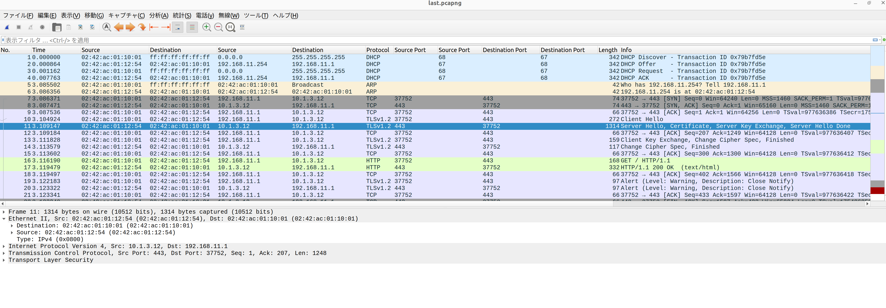

# Wireshark 使用方法

1. tcpdump -w <ファイル名>を使用してパケットをキャプチャーしてファイルに書き込む
2. tcpdump で作成したファイルを Wireshark で開く

## 表示列のカスタマイズ機能

パケット詳細欄に表示されている項目を右クリックした後、「列として適用」をクリックするとパケット一覧にその項目が追加される。

## 表示フィルター機能

表示フィルター機能を使用してプロトコルの種類や内容でパケットを絞り込む。

| プロトコル   | 表示フィルター      | 意味                                                   | 記述例                                    |
| :----------- | :------------------ | :----------------------------------------------------- | :---------------------------------------- |
| イーサネット | eth.addr            | 宛先・送信元 MAC アドレス                              | eth.addr == 04:7c:16:d4:6f:2b             |
|              | eth.src             | 送信元 MAC アドレス                                    | eth.src == 04:7c:16:d4:6f:2b              |
|              | eth.dst             | 宛先 MAC アドレス                                      | eth.dst == 04:7c:16:d4:6f:2b              |
|              | eth.type            | イーサネットペイロードのプロトコル                     | eth.type == 0x800（ipv4）                 |
| ARP          | arp.opcode          | オペレーションコード（1:ARP Request, 2: ARP Response） | arp.opcode == 1                           |
|              | arp.src.hw_mac      | 送信元 MAC アドレス                                    | arp.src.hw_mac == 04:7c:16:d4:6f:2b       |
|              | arp.src.proto_ipv4  | 送信元 IP アドレス                                     | arp.src.proto_ipv4 == 10.1.1.1            |
|              | arp.dst.hw_mac      | 宛先 MAC アドレス                                      | arp.dst.hw_mac == 04:7c:16:d4:6f:2b       |
|              | arp.dst.proto_ipv4  | 宛先 IP アドレス                                       | arp.dst.proto_ipv4 == 10.1.1.1            |
| IP           | ip.version          | IP のバージョン                                        | ip.version == 4                           |
|              | ip.addr             |                                                        | ip.addr == 192.168.1.1                    |
|              | ip.host             |                                                        | ip.host == www.google.com                 |
|              | ip.dst              |                                                        | ip.dst == 192.168.1.1                     |
|              | ip.dst_host         |                                                        |                                           |
|              | ip.src              |                                                        |                                           |
|              | ip.src_host         |                                                        |                                           |
|              | ip.ttl              |                                                        |                                           |
| ICMP         | icmp                | ICMP パケット                                          | icmp                                      |
|              | icmp.type           | タイプの値                                             | icmp.type == 8                            |
|              | icmp.code           | コードの値                                             | icmp.code == 0                            |
| UDP          | udp                 | UDP のパケットを表示する                               | udp                                       |
|              | udp.port            | UDP のポート番号                                       | udp.port == 80                            |
|              | udp.srcport         | UDP の送信元ポート番号                                 | udp.srcport == 30000                      |
|              | udp.dstport         | UDP の宛先ポート番号                                   | udp.dstport == 80                         |
| TCP          | tcp                 | TCP のパケットを表示する                               | tcp                                       |
|              | tcp.port            | TCP のポート番号                                       | tcp.port == 80                            |
|              | tcp.srcport         | TCP の送信元ポート番号                                 | tcp.srcport == 30000                      |
|              | tcp.dstport         | TCP の宛先ポート番号                                   | tcp.dstport == 80                         |
| HTTP         | http                | HTTP メッセージすべて                                  | http                                      |
|              | http.request        | HTTP リクエストすべて                                  | http.request                              |
|              | http.response       | HTTP レスポンスすべて                                  | http.response                             |
|              | http.request.method | メソッド                                               | http.request.method == GET                |
|              | http.response.code  | ステータスコード                                       | http.response.code == 200                 |
|              | http.host           | Host ヘッダー（通信相手）                              | http.host == 'www.example.com'            |
|              | http.location       | Location ヘッダー                                      | http.location == 'http://www.yahoo.co.jp' |
